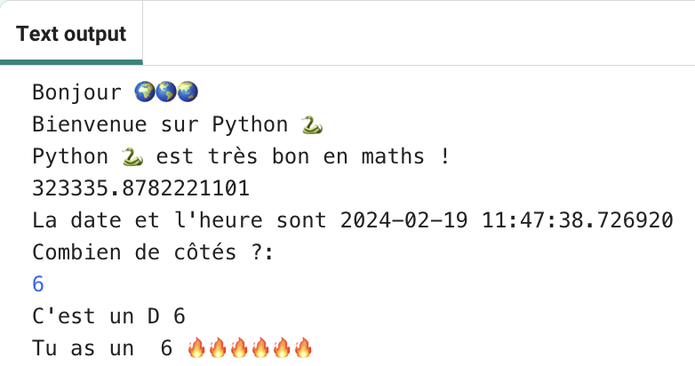

## Lancer un dé 🎲

Crée une fonction pour lancer un dé en utilisant des nombres aléatoires. 
  
En Python :
  - **fonctions**, définie avec `def`, sont comme 'mes blocs' dans Scratch,
  - `randint` est comme 'random' dans Scratch, et
  - `input` est comme 'demander' dans Scratch.

{:width="300px"} 

En Python, tu **appelles** une **fonction()** pour effectuer une action. Tu as déjà utilisé la fonction `print()` pour afficher du texte.

Tu peux **définir** une nouvelle **fonction** pour regrouper le code afin de pouvoir le nommer et le réutiliser.

### Définir ta fonction

--- task ---

Les fonctions doivent être définies avant de pouvoir les appeler. Recherche le commentaire en haut de l'onglet **main.py** qui indique `# Définitions de fonctions`.

Définis une nouvelle fonction appelée `roule_de()` qui utilise la fonction `randint()`, de la bibliothèque `random`, pour générer un « entier » aléatoire (nombre entier) de 1 à 6 et le sortir à l'écran.

--- code ---
---
language: python filename: main.py line_numbers: true line_number_start: 15
line_highlights: 16-17
---

# Définitions de fonctions
def roule_de() :  # N'oublie pas les deux points à la fin de cette ligne   
print('Tu as un', randint(1, 6))  # randint(1, 6) est utilisé pour donner un nombre entre 1 et 6.

--- /code ---

Les lignes sous `def roule_de():` sont **indentées**. Pour ce faire, utilise la touche <kbd>Tab</kbd> de ton clavier (généralement au-dessus de <kbd>VER MAJ</kbd> sur le clavier). Le code d'indentation indique à Python que les lignes indentées font partie de la fonction.

**Astuce :** l'underscore `_` est utilisé entre les mots dans les noms de variables et de fonctions en Python pour les rendre plus faciles à lire. Tu ne peux pas utiliser d'espace.

--- collapse ---
---
title: Saisie de caractères spéciaux sur un clavier français
---

Sur un clavier français, le deux-points `:` se trouve sur la même touche que la barre de division (/), à côté de la touche <kbd>=</kbd>. L'underscore `_` est sur la même touche que le `-`, à côté du <kbd>)</kbd>, maintiens <kbd>Maj</kbd> et appuie sur <kbd>-</kbd> pour taper un `_`.

--- /collapse ---

--- /task ---

--- task ---

**Test :** si tu « exécutes » ton code maintenant, il ne lancera pas de dé. C'est parce que tu as défini la fonction `roule_de()`, mais que tu ne l'as pas encore appelée.

**Débogage :**

--- collapse ---
---
title: J'ai une erreur de syntaxe
---

- Assure-toi d'avoir un underscore `_` entre roule et de pour faire le nom de la fonction.

- Assure-toi d'avoir un deux-points `:` à la fin de la ligne.

- Vérifie que la ligne située sous `def roule_de()` est indentée. Il est très courant de se tromper en Python, alors vérifie bien.

--- /collapse ---

--- /task ---

### Appeler ta fonction

--- task ---

Pour utiliser une fonction, tu dois **l'appeler** dans le code. Va à la fin de ton code et ajoute une nouvelle ligne pour appeler la fonction `roule_de()` :

--- code ---
---
language: python filename: main.py line_numbers: true line_number_start: 25
line_highlights: 27
---

print('La date et l\'heure est', datetime.now())

roule_de() # Appelle la fonction roule de

--- /code ---

--- /task ---

--- task ---

**Test :** exécute ton projet plusieurs fois pour voir le résultat du dé aléatoire à chaque fois.

--- /task ---

Les utilisations des nombres aléatoires comprennent la cryptographie, la science des données et l'ajout de variété dans les jeux et l'art informatique. Les ordinateurs génèrent des **nombres aléatoires** à l'aide d'un algorithme. Pour les nombres vraiment aléatoires, tu as besoin d'une entrée imprévisible du monde réel.

### Utiliser 🔥🔥🔥 pour le nombre obtenu

--- task ---

Ta fonction peut utiliser la variable emoji 🔥 . Le code `print(feu * 3)` génère trois emoji de feu '🔥🔥🔥'. Tu dois sortir le nombre correct d'emojis pour correspondre au nombre obtenu.

Modifie ton code pour enregistrer la valeur renvoyée par `randint()` dans une variable appelée `rouler`. Utilise cette variable pour imprimer le nombre obtenu avec le nombre correspondant d'émojis 🔥.

--- code ---
---
language: python filename: main.py line_numbers: true line_number_start: 15
line_highlights: 17-18
---

# Définitions de fonctions
def roule_de(): rouler = randint(1, 6)  # Générer un nombre aléatoire entre 1 et 6 et le stocker dans la variable "rouler". print('Tu as un', rouler, feu * rouler)  # Répète l'emoji feu pour qu'il corresponde au lancer de dé aléatoire

--- /code ---

**Astuce** tu peux utiliser `étoile` ou `cœur` à la place de `feu` si tu préfères, en créant tes propres variables emoji.

--- /task ---

--- task ---

**Test :** teste ton projet plusieurs fois. Assure-toi de bien comprendre le fonctionnement du code.

--- /task ---

### Choisir le nombre de faces du dé

Améliore tes dés afin que l'utilisateur puisse choisir le nombre maximum.

De nombreux jeux utilisent des dés à plusieurs côtés. Dans le monde physique, les dés sont fabriqués à partir de formes géométriques régulières. Les dés courants incluent D6, D12 et D20. Sur un ordinateur, tu peux générer un nombre aléatoire pour faire un dé équitable avec n'importe quel nombre de côtés.

--- task ---

La fonction `input()` pose une question à l'utilisateur puis renvoie sa réponse.

**Ajoute** du code pour demander à l'utilisateur le plus grand nombre sur son dé, puis enregistre le résultat dans une variable appelée `max` et `print` le nombre choisi dans la zone de sortie :

Modifie ton code variable `rouler` pour utiliser `max` comme valeur maximale pour `randint` lorsqu'il génère un nombre aléatoire.

Lorsque tu reçois une entrée de l'utilisateur, Python la traite comme du texte. Mais, `randint` a besoin d'un « integer » (un nombre entier positif). La fonction `int` transforme l'entrée utilisateur en entier.

--- code ---
---
language: python filename: main.py line_numbers: true line_number_start: 15
line_highlights: 18-20
---

# Définitions de fonctions

def roule_de():   
max = input('Combien de côtés ?:')  # Attendre l'intervention de l'utilisateur    
print('C\'est un D', max)  # Utiliser le numéro que l'utilisateur a saisi    
rouler = randint(1, int(max))  # Utiliser la valeur maximale pour déterminer le nombre de faces du dé print('Tu as un', rouler, feu * rouler)

--- /code ---

Pour imprimer une apostrophe `'` dans un mot comme `C'est`, place une barre oblique inverse `\` devant afin que Python sache que cela fait partie du texte.

--- /task ---

--- task ---

**Test :** exécute ton projet. Lorsque le programme atteint la ligne `input`, il attendra que tu saisisses une réponse avant de continuer. Tape ta réponse puis appuie sur <kbd>Entrée</kbd>, cela permettra au programme de collecter ta réponse. Essaie à nouveau avec un autre numéro d'`entrée`.

--- /task ---

--- save ---
