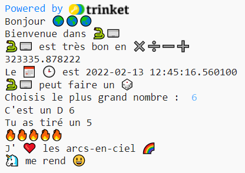

## Début de phrase

Sors plus de phrases de ton projet.

{:width="300px"} 

--- task ---

Ajoute plus de lignes `print` à ton code. Voici quelques débuts de phrases que tu peux utiliser :

--- code ---
---
language: python
filename: main.py
line_numbers: true
line_number_start: 29
line_highlights: 30-32
---

roule_de()  # Appeler la fonction roule de
print('J\' ❤️ ...')   
print('... me rend 😃')   
print('J\'aimerais créer ... avec', python)

--- /code ---

**Astuce :** chaque utilisation de `print` ajoute une ligne entre les deux.

**Astuce :** si tu as besoin d'afficher une apostrophe `'`, tu dois placer une barre oblique inverse `\` devant afin que Python sache qu'elle fait partie du texte.

**Astuce :** ajoute un `#` au début d'une ligne pour la transformer en commentaire.

--- /task ---

L'emoji cœur jaune 💛 est souvent utilisé pour exprimer l'amitié et le bonheur.

--- task ---

Quel message voudrais-tu envoyer à un ami pour lui remonter le moral ? Quel emoji choisirais-tu ?

Fais défiler la section **emoji** dans le Code Editor pour voir les emojis et les variables d'exemple que tu peux utiliser. Copie ceux que tu choisis et enregistre-les dans une variable ou ajoute-les directement à ton code.

Tu peux ajouter d'autres emojis dans la section **emoji**. Utilise cette [liste d'emojis](https://unicode.org/emoji/charts/full-emoji-list.html){:target="_blank"} pour trouver ceux que tu veux.

🎊 🙌 🙌🏼 🙌🏽 🙌🏾 🙌🏿 😃 🕒 🎨 🎮 🔬 🎉 🕶️ 🎲 😊
🦄 🚀 💯 ⭐ 💛 ❤️ 📚 ⚽ 🏏 🏀 🥋 🏆 ✨ 🥺 🌈 🔥 ♻️ 🌳
👩‍🦽👩🏼‍🦽👩🏽‍🦽👩🏾‍🦽👩🏿‍🦽🧘 🧘🏼 🧘🏽 🧘🏾 🧘🏿 🙋 🙋🏼 🙋🏽 🙋🏾 🙋🏿

[[[choose-an-emoji]]]

--- /task ---

--- save ---
