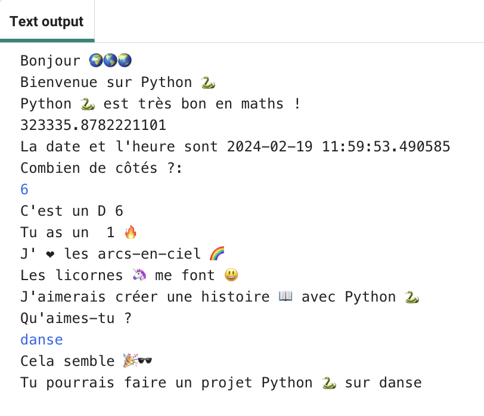

## Améliorer ton projet

Ajoute plus à ton projet. Il y a plus d'emojis à choisir.
  

{:width="300px"} 

Tu pourrais :
+ Utiliser `print` avec un texte et des emojis différents
+ Utiliser `input` pour obtenir des valeurs de l'utilisateur et les stocker en tant que variables, puis faire des sommes avec les variables
+ Écrire plus de fonctions pour organiser ton code
+ Utiliser `#` pour ajouter des commentaires à ton code

Fais défiler la section **emoji** dans le Code Editor pour voir les emojis et les variables d'exemple que tu peux utiliser. Copie ceux que tu choisis et enregistre-les dans une variable ou ajoute-les directement à ton code.

**Astuce :** pour ajouter des emojis, retrouve le commentaire # Emojis à copier et coller dans ton code. Copie les emojis que tu souhaites utiliser puis colle-les dans ton code.

🎊 🙌 🙌🏼 🙌🏽 🙌🏾 🙌🏿 # 😃 🕒🎨🎮🔬🎉🕶️🎲 😊
🦄🚀💯⭐💛❤️📚⚽🏏🏀🥋🏆✨🥺🌈🔥♻️🌳
👩‍🦽👩🏼‍🦽👩🏽‍🦽👩🏾‍🦽👩🏿‍🦽🧘 🧘🏼 🧘🏽 🧘🏾 🧘🏿 🙋🙋🏼🙋🏽🙋🏾🙋🏿

[[[choose-an-emoji]]]

Voici un exemple de fonction qui pose des questions sur les hobbies :

--- code ---
---
language: python
filename: main.py
---

# Mettre le code à exécuter ci-dessous
def hobbies():   
    hobby = input('Qu\'aimes-tu ?')   
    print('Cela semble', fun) # Tu vas devoir créer une variable emoji appelée 'fun'
    print('Tu pourrais créer un', python, 'projet sur', hobby)

--- /code ---

**Astuce :** n'oublie pas que tu devras appeler ta fonction et la définir.

Tu peux utiliser `input` pour que ton projet attende que l'utilisateur tape sur <kbd>Entrée</kbd> à n'importe quel moment de ce projet.

--- code ---
---
language: python
filename: main.py
---

roule_de()

input() # Attend que l'utilisateur appuie sur Entrée

hobbies()

--- /code ---

--- collapse ---
---
title: Le projet terminé
---

Tu peux voir le [projet terminé ici](https://editor.raspberrypi.org/fr-FR/projects/hello-world-solution){:target="_blank"}.

--- /collapse ---

--- save ---
