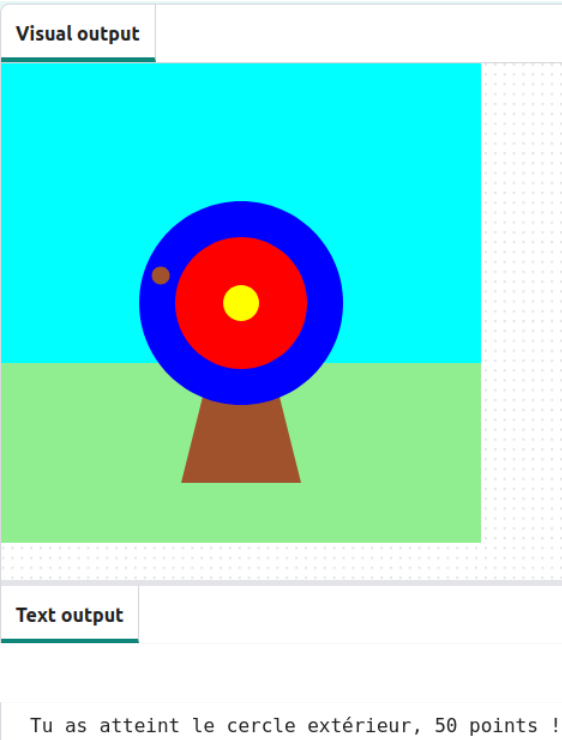

## Que peux-tu faire maintenant ?

Si tu suis le parcours [Introduction à Python](https://projects.raspberrypi.org/fr-FR/raspberrypi/python-intro), tu peux passer au projet [Tir sur cible](https://projects.raspberrypi.org/fr-FR/projects/target-practice). Dans ce projet, tu vas dessiner une cible puis créer un jeu de tir à l'arc qui tire des flèches pour marquer des points.

--- print-only ---

{:width="640px"}

--- /print-only ---

--- no-print ---

Clique sur le bouton **Run** pour afficher un exemple de ce projet.

<iframe src="https://editor.raspberrypi.org/fr-FR/embed/viewer/target-practice-solution" width="600" height="600" frameborder="0" marginwidth="0" marginheight="0" allowfullscreen>
</iframe>

--- /no-print ---

Ou, pourquoi ne pas essayer un autre projet [Python](https://projects.raspberrypi.org/fr-FR/projects?software%5B%5D=python).

***

Ce projet a été traduit par des bénévoles:

Michel Arnols
Jonathan Vannieuwkerke

Grâce aux bénévoles, nous pouvons donner aux gens du monde entier la chance d'apprendre dans leur propre langue. Vous pouvez nous aider à atteindre plus de personnes en vous portant volontaire pour la traduction - plus d'informations sur [rpf.io/translate](https://rpf.io/translate).

