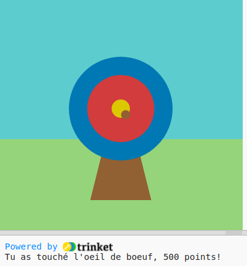

## Et ensuite ?

Si tu suis le parcours [Introduction à Python](https://projects.raspberrypi.org/en/raspberrypi/python-intro) , tu peux passer au projet [Entraînement au tir](https://projects.raspberrypi.org/en/projects/target-practice). Dans ce projet, tu vas dessiner une cible puis créer un jeu de tir à l'arc qui tire des flèches pour marquer des points.

--- print-only ---

--- /print-only ---

--- no-print ---

<iframe src="https://trinket.io/embed/python/f686c82d8a?outputOnly=true&start=result" width="600" height="500" frameborder="0" marginwidth="0" marginheight="0" allowfullscreen>
</iframe>

--- /no-print ---

Si tu veux t'amuser davantage en explorant Python, tu peux essayer n'importe lequel de [ces projets](https://projects.raspberrypi.org/en/projects?software%5B%5D=python).
