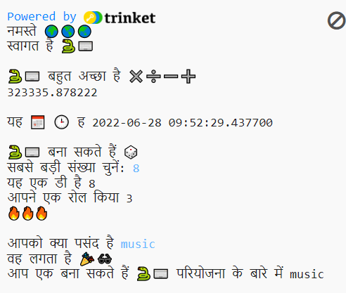

## परिचय

इमोजी का उपयोग करने वाला एक इंटरैक्टिव प्रोजेक्ट लिखकर पता करें कि Python प्रोग्रामिंग भाषा क्या कर सकती है।

**Emoji** एक छोटे रंगीन चित्र हैं जिनका उपयोग संदेशों में अतिरिक्त अर्थ जोड़ने के लिए किया जाता है। इमोजी का मतलब जापानी में 'पिक्चर वर्ड' होता है।

आप:
+ `print()` टेक्स्ट, इमोजी सहित, और उपयोगकर्ता से `input()` प्राप्त करें
+ पाठ और संख्याओं को **वेरिएबलस** में संग्रहीत करें
+ अपने कोड को व्यवस्थित करने के लिए **फंक्शन्स** का उपयोग करें

--- no-print ---

### इसे आजमाएँ!

--- task ---

  
आउटपुट पढ़ें और फिर जारी रखने के लिए <kbd>Enter</kbd> पर टैप करें। 
अपने प्रश्नों के उत्तर टाइप करें। क्या आप देख सकते हैं कि आपके उत्तरों का उपयोग कैसे किया जाता है?

  <iframe src="https://trinket.io/embed/python/a54e164ac2?outputOnly=true&start=result" width="600" height="500" frameborder="0" marginwidth="0" marginheight="0" allowfullscreen>
  </iframe>
  

--- /task ---

--- /no-print ---

--- print-only ---

--- /print-only ---

