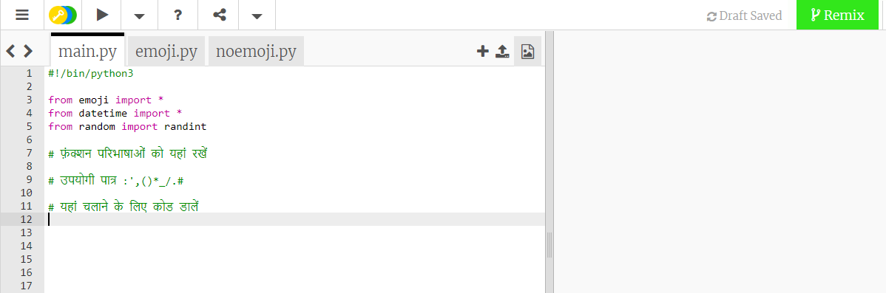
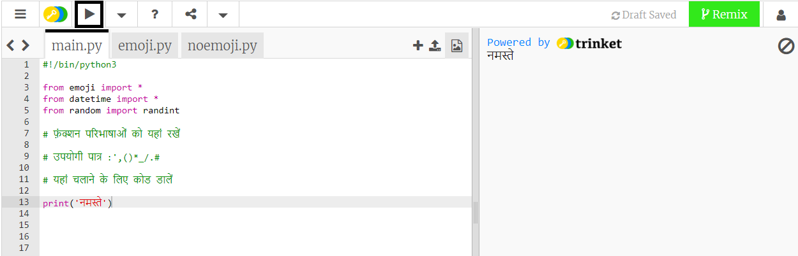
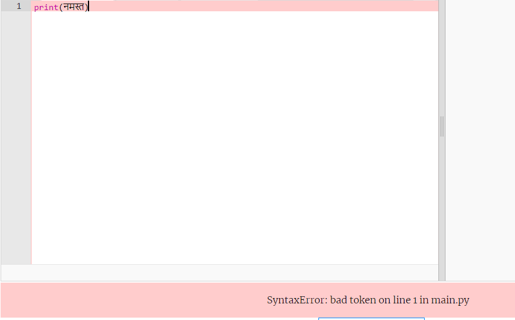
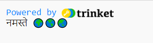
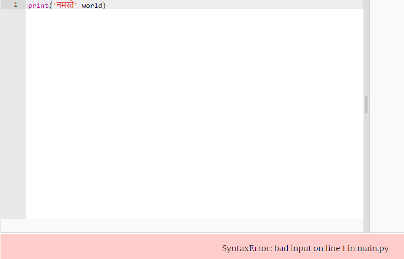
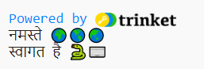

## नमस्ते कहें

'Hello world!' के आउटपुट के लिए प्रोग्राम लिखना पारंपरिक है जब आप एक नई प्रोग्रामिंग भाषा सीखते हैं।

{:width="200px"}

--- task ---

[Hello 🌍🌎🌏 शुरूआती प्रोजेक्ट](https://trinket.io/python/975f35023b){:target="_blank"} खोले Trinket अन्य ब्राउज़र टैब में खुलेगा।

--- /task ---

पंक्ति `#!/bin/python3` Trinket को बताती है कि आप Python 3 (नवीनतम संस्करण) का उपयोग कर रहे हैं। `import` लाइनें Python को बताती हैं कि आप उस कोड का उपयोग करने जा रहे हैं जिसे आपने नहीं लिखा है।

Python में, `print()` स्क्रीन पर टेक्स्ट (शब्द या संख्या) को आउटपुट करता है।

`#` के साथ शुरू होने वाली पंक्तियाँ टिप्पणियाँ हैं, वे मानव को कोड समझाती हैं और Python द्वारा अनदेखा कर दी जाती हैं।

--- task ---

`# यहां नीचे चलाने के लिए कोड डालें ` यह लाइन ढूँढे।

उस रेखा के नीचे क्लिक करें। फ़्लैशिंग `|` कर्सर है और दिखाता है कि आप कहां टाइप करेंगे।

hello `print()` करने के लिए कोड टाइप करें:

--- code ---
---
language: python filename: main.py line_numbers: true line_number_start: 11
line_highlights: 12
---

# यहां चलाने के लिए कोड डालें
print('Hello')

--- /code ---

--- collapse ---
---
title: UK या US कीबोर्ड पर विशेष वर्ण टाइप करना
---

UK या US कीबोर्ड पर, बाएं तरफ `(` और दाएं `)` गोल कोष्ठक <kbd>9</kbd> और <kbd>0</kbd> कुंजियों पर हैं। एक बायाँ गोल कोष्ठक लिखने के लिए, <kbd>Shift</kbd> कुंजी (<kbd>Z</kbd> के आगे) को दबाकर रखें और फिर <kbd>9</kbd> पर टैप करें। एकल उद्धरण `'` उसी पंक्ति पर है जिस पंक्ति में <kbd>L</kbd> कुंजी है, जो <kbd>Enter</kbd> कुंजी से ठीक पहले है। अल्पविराम `,` <kbd>M</kbd> के आगे है।

--- /collapse ---

--- /task ---

--- task ---

**परीक्षण:** अपने कोड को चलाने के लिए **Run** बटन पर क्लिक करें। Trinket में, आउटपुट दाईं ओर दिखाई देगा:

**डीबग:** यदि आपको कोई त्रुटि मिलती है तो अपने कोड को वास्तव में ध्यान से जांचें। इस उदाहरण में, `Hello` के आसपास के सिंगल कोट्स गायब हैं, इसलिए Python को पता नहीं है कि यह टेक्स्ट होना चाहिए।

--- /task ---

Python में, टेक्स्ट या संख्याओं को संग्रहीत करने के लिए एक **वेरिएबल** का उपयोग किया जाता है। वेरिएबलस मानव के लिए कोड पढ़ना आसान बनाता है। आप अपने कोड में कई स्थानों पर एक ही वेरिएबल का उपयोग कर सकते हैं।

हमने कुछ वेरिएबल शामिल किए हैं जो इमोजी वर्णों को स्टोर करते हैं।

--- task ---

अपने Trinket में, **emoji.py** टैब पर क्लिक करें। वह वेरिएबल `world` ढूंढें, जो टेक्स्ट '🌍🌍🌍' को स्टोर करता है।

--- /task ---

--- task ---

आप आइटम्स के बीच में एक अल्पविराम `,` को शामिल करके एक से अधिक आइटम को `print()` कर सकते हैं। `print()` प्रत्येक आइटम के बीच एक स्पेस जोड़ेगा।

अपने `print()` कोड पर वापस जाने के लिए **main.py** टैब पर क्लिक करें।

अपने कोड को भी बदलें ताकि `world` वेरिएबल की सामग्री को भी `print()` कर सके:

--- code ---
---
language: python filename: main.py line_numbers: true line_number_start: 11
line_highlights: 12
---

# यहां चलाने के लिए कोड डालें
print('Hello', world)

--- /code ---

**टिप:** `'Hello'` एक पाठ स्ट्रिंग है क्योंकि इसमें इसके चारों ओर सिंगल कोट्स है, जबकि `world` एक वेरिएबल है इसलिए इसमें संग्रहित मान प्रिंट किया जाएगा।

--- /task ---

--- task ---

**परीक्षण:** परिणाम देखने के लिए अपना कोड चलाएं:

इमोजी अलग-अलग कंप्यूटर पर अलग दिख सकता है, इसलिए हो सकता है कि आपका कंप्यूटर बिल्कुल एक जैसा न दिखे।

**डीबग:** सुनिश्चित करें कि आपने `print()` में आइटम्स के बीच एक अल्पविराम जोड़ा है और आपने `world` को सही ढंग से लिखा है।

इस उदाहरण में अल्पविराम `,` गुम है। यह छोटा है लेकिन बहुत महत्वपूर्ण है!

--- collapse ---
---
title: मुझे इमोजी दिखाई नहीं दे रहे हैं।
---

अधिकांश कंप्यूटर आपको रंगीन इमोजी का उपयोग करने की अनुमति देते हैं। हालांकि, यदि आप emoji का उपयोग नहीं कर सकते हैं, तो आप इसके बजाय 'इमोटिकॉन्स' का उपयोग कर सकते हैं, जैसा कि हमने पहले किया था!

`from emoji import *` पंक्ति को इसमें बदलें:

--- code ---
---
language: python filename: main.py line_numbers: true line_number_start: 3
line_highlights: 3
---

from noemoji import *

--- /code ---

--- /collapse ---

--- /task ---

--- task ---

अपने कोड में एक और पंक्ति जोड़ें `print()` अधिक टेक्स्ट और इमोजी:

--- code ---
---
language: python filename: main.py line_numbers: true line_number_start: 12
line_highlights: 13
---

print('Hello', world)    
print('Welcome to', python)

--- /code ---

**टिप:** जिस कोड को आपको टाइप करने की आवश्यकता है वह हल्के रंग में हाइलाइट किया गया है। कोड जो हाइलाइट नहीं किया गया है, आपको नया कोड जोड़ने के लिए आवश्यक स्थान खोजने में मदद करता है।

--- /task ---

--- task ---

**परीक्षण:** क्लिक करें **Run**।

**टीप:** प्रत्येक बदलाव के बाद अपना कोड चलाना एक अच्छा विचार है ताकि आप समस्याओं को तुरंत ठीक कर सकें।

**डिबग:** कोष्ठकों, उद्धरणों, अल्पविरामों और सही वर्तनी की सावधानीपूर्वक जाँच करें। Python आपको वास्तव में सटीक होना चाहता है।

--- /task ---

यदि आपके पास एक Trinket खाता है, तो आप अपने `My Trinkets` लाइब्रेरी में कॉपी सहेजने के लिए **Remix** बटन पर क्लिक कर सकते हैं।

यदि आपके पास Trinket खाता नहीं है, तो भी आप उसी कंप्यूटर पर भविष्य में स्टार्टर प्रोजेक्ट लिंक का उपयोग करके अपने प्रोजेक्ट पर वापस आ सकते हैं।

--- save ---
