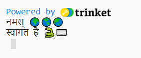

## नमस्ते कहें

<div style="display: flex; flex-wrap: wrap">
<div style="flex-basis: 200px; flex-grow: 1; margin-right: 15px;">
'Hello world!' के आउटपुट के लिए प्रोग्राम लिखना पारंपरिक है जब आप एक नई प्रोग्रामिंग भाषा सीखते हैं।
</div>
<div>

{:width='200px'}

</div>
</div>

--- task ---

[हेलो 🌍🌎🌏 स्टार्टर प्रोजेक्ट](https://editor.raspberrypi.org/en/projects/hello-world-starter){:target='_blank'} खोलें। कोड संपादक दूसरे ब्राउज़र टैब में खुलेगा.


यदि आपके पास रास्पबेरी पाई खाता है, तो आप अपने **प्रोजेक्ट्स**में एक प्रति सहेजने के लिए **Save** बटन पर क्लिक कर सकते हैं.

--- /task ---

--- collapse ---

---
शीर्षक: रास्पबेरी पाई पर काम कर रहे हैं?
---

यदि आप क्रोमियम का उपयोग करके रास्पबेरी पाई पर काम कर रहे हैं, तो आप इमोजी नहीं देख पाएंगे। आपको एक फ़ॉन्ट स्थापित करना होगा जो उनका समर्थन करता हो।

एक टर्मिनल खोलें और फिर टाइप करें:

```bash
sudo apt install fonts-noto-color-emoji
```

क्रोमियम को पुनरारंभ करें और आपको रंगीन इमोजी दिखनी चाहिए।

--- /collapse ---

### नमस्ते प्रिंट करें

<p style="border-left: solid; border-width:10px; border-color: #0faeb0; background-color: aliceblue; padding: 10px;">
`#` से शुरू होने वाली पंक्तियाँ <span style="color: #0faeb0">**टिप्पणियाँ**</span>हैं। वे बताते हैं कि कोड क्या करेगा। पायथन द्वारा टिप्पणियों को नजरअंदाज कर दिया जाता है।
</p>

कोड की शुरुआत में `आयात` लाइनें पायथन को बताती हैं कि आप उस कोड का उपयोग करने जा रहे हैं जो आपने नहीं लिखा है।

पायथन में, `print()` स्क्रीन पर टेक्स्ट (शब्द या संख्या) आउटपुट करता है।

--- task ---

`# यहां नीचे चलाने के लिए कोड डालें` लाइन ढूंढें।

उस लाइन के नीचे क्लिक करें. चमकती `|` कर्सर है और दिखाता है कि आप कहां टाइप करेंगे।

--- /task ---

--- task ---

Hello `print()` करने के लिए कोड टाइप करें:

**Tip:** When you type an opening bracket `(` or opening apostrophe `'` the code editor will automatically add a closing bracket `)` or closing apostrophe`'`:

--- code ---
---
language: python filename: main.py line_numbers: true line_number_start: 17
line_highlights: 18
---

# यहां चलाने के लिए कोड डालें
print('Hello' world)

--- /code ---

--- collapse ---
---
शीर्षक: यूके या यूएस कीबोर्ड पर विशेष अक्षर टाइप करना
---

UK या US कीबोर्ड पर, बाएं तरफ `(` और दाएं `)` गोल कोष्ठक <kbd>9</kbd> और <kbd>0</kbd> कुंजियों पर हैं। एक बायाँ गोल कोष्ठक लिखने के लिए, <kbd>Shift</kbd> कुंजी (<kbd>Z</kbd> के आगे) को दबाकर रखें और फिर <kbd>9</kbd> पर टैप करें। एकल उद्धरण `'` उसी पंक्ति पर है जिस पंक्ति में <kbd>L</kbd> कुंजी है, जो <kbd>Enter</kbd> कुंजी से ठीक पहले है। अल्पविराम `,` <kbd>M</kbd> के आगे है।

--- /collapse ---

--- /task ---

--- task ---

**परीक्षण:** अपने कोड को चलाने के लिए **Run** बटन पर क्लिक करें। Trinket में, आउटपुट दाईं ओर दिखाई देगा:


**डीबग:** यदि आपको कोई त्रुटि मिलती है तो अपने कोड को वास्तव में ध्यान से जांचें। इस उदाहरण में, `Hello` के आसपास के सिंगल कोट्स गायब हैं, इसलिए Python को पता नहीं है कि यह टेक्स्ट होना चाहिए।


--- /task ---

## Print 🌍🌎🌏

Python में, टेक्स्ट या संख्याओं को संग्रहीत करने के लिए एक **वेरिएबल** का उपयोग किया जाता है। वेरिएबलस मानव के लिए कोड पढ़ना आसान बनाता है। आप अपने कोड में कई स्थानों पर एक ही वेरिएबल का उपयोग कर सकते हैं। किसी वेरिएबल के लिए एक समझदार नाम चुनने से आपके लिए यह याद रखना आसान हो जाता है कि यह किस लिए है।

हमने कुछ वेरिएबल शामिल किए हैं जो इमोजी वर्णों को स्टोर करते हैं।

--- task ---

अपने कोड संपादक में, दो अलग-अलग वेरिएबल्स में संग्रहीत इमोजी वाली पंक्तियों तक स्क्रॉल करें। वेरिएबल `वर्ल्ड`ढूंढें, जो '🌍🌍🌍' टेक्स्ट को स्टोर करता है।

--- /task ---

--- task ---

आप आइटम्स के बीच में एक अल्पविराम `,` को शामिल करके एक से अधिक आइटम को `print()` कर सकते हैं। `print()` will add a space between each item.

अपने कोड को बदलें ताकि `world` वेरिएबल की सामग्री को भी `print()` कर सके:

--- code ---
---
language: python filename: main.py line_numbers: true line_number_start: 17
line_highlights: 18
---

# यहां चलाने के लिए कोड डालें
print('Hello', world)

--- /code ---

**टिप:** `'Hello'` एक पाठ स्ट्रिंग है क्योंकि इसमें इसके चारों ओर सिंगल कोट्स है, जबकि `world` एक वेरिएबल है इसलिए इसमें संग्रहित मान प्रिंट किया जाएगा।

--- /task ---

--- task ---

**परीक्षण:** परिणाम देखने के लिए अपना कोड चलाएं:


इमोजी अलग-अलग कंप्यूटर पर अलग दिख सकता है, इसलिए हो सकता है कि आपका कंप्यूटर बिल्कुल एक जैसा न दिखे।

**डीबग:** सुनिश्चित करें कि आपने `print()` में आइटम्स के बीच एक अल्पविराम जोड़ा है और आपने `world` को सही ढंग से लिखा है।

इस उदाहरण में अल्पविराम `,` गुम है। यह छोटा है लेकिन बहुत महत्वपूर्ण है!


--- /task ---

--- task ---

**अपने कोड में** एक और लाइन जोड़ें `print()` अधिक टेक्स्ट और इमोजी:

--- code ---
---
भाषा: पायथन फ़ाइल नाम: main.py लाइन_नंबर: सच लाइन_नंबर_स्टार्ट: 18
line_highlights: 19
---

print('Hello', world)    
print('Welcome to', python)

--- /code ---

**टिप:** जिस कोड को आपको टाइप करने की आवश्यकता है वह हल्के रंग में हाइलाइट किया गया है। कोड जो हाइलाइट नहीं किया गया है, आपको नया कोड जोड़ने के लिए आवश्यक स्थान खोजने में मदद करता है।

--- /task ---

--- task ---

**Test:** Click **Run**.


**टीप:** प्रत्येक बदलाव के बाद अपना कोड चलाना एक अच्छा विचार है ताकि आप समस्याओं को तुरंत ठीक कर सकें।

**डिबग:** कोष्ठकों, उद्धरणों, अल्पविरामों और सही वर्तनी की सावधानीपूर्वक जाँच करें। Python आपको वास्तव में सटीक होना चाहता है।

--- /task ---

If you have a Raspberry Pi account, on your code editor you can click on the **Save** button to save a copy of your project to your Projects.

--- save ---
