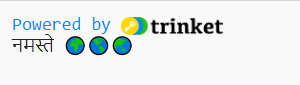
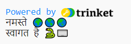

## नमस्ते प्रिंट करें

पायथन में, `print()`{:.language-python} स्क्रीन पर स्ट्रिंग्स (शब्द या संख्या) आउटपुट करता है।

--- task ---

[हेलो 🌍🌎🌏 स्टार्टर प्रोजेक्ट](https://editor.raspberrypi.org/en/projects/hello-world-starter){:target='_blank'} खोलें। कोड संपादक दूसरे ब्राउज़र टैब में खुलेगा.

--- /task ---

--- task ---

`# यहां चलाने के लिए कोड डालें`{:.language-python} लाइन ढूंढें।

उस पंक्ति के नीचे क्लिक करें. चमकती `|` कर्सर है और दिखाता है कि आप कहां टाइप करेंगे।

--- /task ---

--- task ---

कोड टाइप करें `print()`{:.language-python} स्क्रीन को नमस्कार करें:

--- code ---
---
language: python line_numbers: true line_number_start: 20
line_highlights: 21
---
# Put code to run under here.
print(f'Hello')

--- /code ---

--- /task ---

--- task ---

**परीक्षण:** अपने कोड को चलाने के लिए **Run** बटन पर क्लिक करें।

आपको टेक्स्ट आउटपुट क्षेत्र में `हैलो` दिखाई देगा।

--- /task ---

**चर** का उपयोग पाठ या संख्याओं जैसे मानों को संग्रहीत करने के लिए किया जाता है। हमने कुछ वेरिएबल शामिल किए हैं जो इमोजी वर्णों को स्टोर करते हैं।

--- task ---

अपने कोड को `print()`{:.language-python} `world`{:.language-python} वेरिएबल की सामग्री में भी बदलें। आप ऐसा कर्ली ब्रैकेट में वेरिएबल नाम जोड़कर कर सकते हैं `{}`{:.language-python}

--- code ---
---
language: python line_numbers: true
line_number_start: 20
---
# यहां चलाने के लिए कोड डालें
print(f'Hello {world}')

--- /code ---

प्रिंट के अंदर `f`{:.language-python} वर्ण आपको टेक्स्ट की स्ट्रिंग के साथ-साथ वेरिएबल्स को भी आसानी से प्रिंट करने की सुविधा देता है।

--- /task ---

--- task ---

**परीक्षण:** परिणाम देखने के लिए अपना कोड चलाएं:

--- /task ---

--- task ---

**अपने कोड में** एक और पंक्ति जोड़ें ताकि `प्रिंट()`{:.language-python} अधिक टेक्स्ट और इमोजीज़ हों:

--- code ---
---
language: python line_numbers: true line_number_start: 20
line_highlights: 22
---
# Put code to run under here
print(f'Hello {world}') print(f'Welcome to {python}')

--- /code ---

--- /task ---

--- task ---

कोड संपादक में कोड की अतिरिक्त पंक्ति जिसमें 'हैलो' शब्द के बाद तीन विश्व इमोजी और 'वेलकम टू' शब्द के बाद एक इमोजी स्नेक और कीबोर्ड आउटपुट क्षेत्र में दिखाई दे रहा है।

**टीप:** प्रत्येक बदलाव के बाद अपना कोड चलाना एक अच्छा विचार है ताकि आप समस्याओं को तुरंत ठीक कर सकें।

--- /task ---

