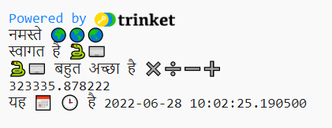
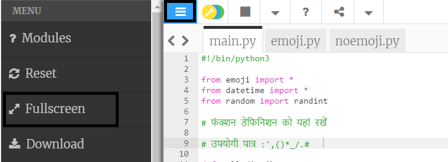

## रकम और दिनांक

Python संख्याओं और दिनांकों के साथ काम करने पर शानदार है।

{:width="300px"} 

Python में आप गणित ऑपरेटरों का उपयोग कर सकते हैं योग करने के लिए:

| + | add |   
| - | subtract |   
| * | multiply |   
| / | divide |   
| ** | to the power |

### Create a calculation

--- task ---

अपने कोड में और दो `print()` लाइनें जोड़ें जिसमें Python को काम करने के लिए एक योग शामिल है:

**Tip:** To get a `*` symbol press <kbd>Shift</kbd> and <kbd>8</kbd> at the same time.

--- code ---
---
language: python filename: main.py line_numbers: true line_number_start: 18
line_highlights: 20-21
---

प्रिंट('हैलो', दुनिया)   
प्रिंट('आपका स्वागत है', पायथन)   
प्रिंट(पायथन, ' गणित में बहुत अच्छा है!')   
प्रिंट(230 * 5782 ** 2 / 23781) # योग का परिणाम प्रिंट करें

--- /code ---

**युक्ति:** आपको टिप्पणियाँ टाइप करने की आवश्यकता नहीं है, वे केवल आपको कोड समझने में मदद करने के लिए हैं। बस `#`से पहले कोड टाइप करें।

--- /task ---

--- task ---

**परीक्षण:** अपना प्रोजेक्ट चलाएँ। क्या पायथन ने योग की सही गणना की? केवल मजाक कर रहा है! पायथन आपके लिए कठिन गणित करता है इसलिए आपको इसे हल करने की आवश्यकता नहीं है।

**डीबग:**

--- collapse ---
---
शीर्षक: मेरे पास एक सिंटैक्स त्रुटि है
---

`डीबग:` सुनिश्चित करें कि आपने `print()` में आइटम्स के बीच एक अल्पविराम जोड़ा है और आपने `world` को सही ढंग से लिखा है।

--- /collapse ---

--- /task ---

जापानी कंप्यूटर वैज्ञानिक **एम्मा हारुका इवाओ** ने पाई (*π*) के मान को 31 ट्रिलियन अंकों तक परिकलित करने के लिए एक कंप्यूटर का उपयोग किया। यह उत्तर इतना लंबा है कि इसे कहने में 300,000 वर्ष से अधिक का समय लग जाएगा! 

--- task ---

Python द्वारा किए गए योग को एक जटिल योग में बदलने का प्रयास करें!

आप कोष्ठक का उपयोग भी कर सकते हैं यदि आप उस क्रम को नियंत्रित करना चाहते हैं जिसमें Python योग की गणना करता है: `print ((2 + 4) * (5 + 3))`।

--- /task ---

--- task ---

**परीक्षण:** अपना कोड चलाएं और अपनी राशि की गणना करने के लिए पायथन प्राप्त करें।

**डिबग:** सुनिश्चित करें कि आपके योग के चारों ओर बाएँ और दाएँ गोल ब्रैकेट हैं `(2 * 45)`। यदि आप ऑर्डर को नियंत्रित करने के लिए अतिरिक्त कोष्ठकों का उपयोग करते हैं, तो प्रत्येक बाएँ ब्रैकेट से मेल करने के लिए आपके पास एक दायाँ ब्रैकेट है।

--- /task ---

--- task ---

कोड संपादक पर, आपको पाठ पढ़ने के लिए बहुत बड़ा या बहुत छोटा लग सकता है। आप अपनी पसंद के अनुरूप इन सेटिंग्स को आसानी से बदल सकते हैं।

**टिप:** अपने कोड संपादक के बाईं ओर **सेटिंग्स मेनू**  पर क्लिक करें। फिर टेक्स्ट का आकार बदलने के लिए किसी भी **टेक्स्ट साइज़** बटन पर क्लिक करें।

You can also switch between colour modes, click on the **Light & Dark** buttons to see the changes.

--- /task ---

The line `from datetime import *` at the top of the **main.py** tab includes a library with helpful functions for getting the current date and time.

One of the great things about Python is all the **libraries** of code that are available to use. A Python library allows you to easily use code that other people have written. There are libraries for drawing charts and graphs, making art, doing calculations, and lots more.

--- task ---

Add another line to your code to `print` the current date and time.

`datetime` लाइब्रेरी से `now()` फ़ंक्शन का उपयोग करके वर्तमान दिनांक और समय प्राप्त करें:

--- code ---
---
language: python filename: main.py line_numbers: true line_number_start: 20
line_highlights: 22
---

प्रिंट (Python, 'इस पर बहुत अच्छा है', रकम)    
प्रिंट (230 * 5782 ** 2/23781) # योग का परिणाम प्रिंट करें     
प्रिंट ( 'The', calendar, clock, 'is', datetime.now()) #इमोजी के साथ प्रिंट करें

--- /code ---

**युक्ति:** आपको टिप्पणियाँ टाइप करने की आवश्यकता नहीं है, वे कोड को समझने में आपकी मदद करने के लिए बस वहाँ हैं। बस `#` से पहले के भाग को टाइप करें।

--- /task ---

--- task ---

**परीक्षण:** दिनांक और समय अपडेट देखने के लिए अपना कोड कुछ बार चलाएं।

**डिबग:** जांचें कि आपके पास `datetime` और `now` के बीच फुलस्टॉप `.` है सभी विराम चिह्न सावधानीपूर्वक जांचें।

--- /task ---

--- save ---
