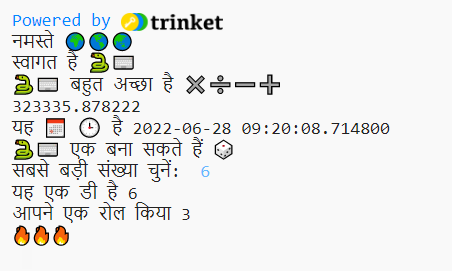
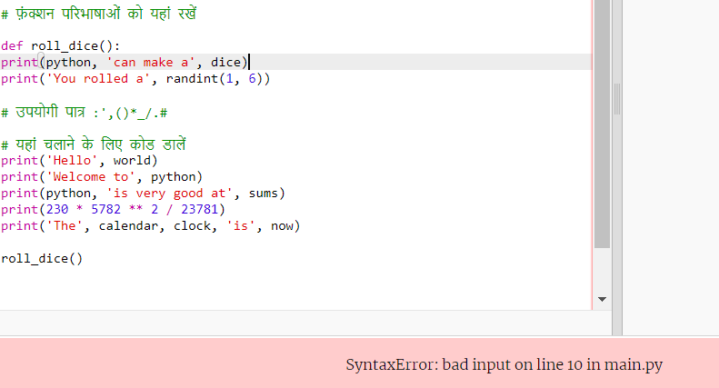

## एक डाईस रोल करें

यादृच्छिक संख्याओं का उपयोग करके पासा घुमाने के लिए एक फ़ंक्शन बनाएं। 
  
पायथन में:
  - **फ़ंक्शन**, `def` के साथ परिभाषित, स्क्रैच में 'मेरे ब्लॉक' की तरह हैं,
  - स्क्रैच में 'रैंडिंट' 'रैंडम' की तरह है, और
  - `इनपुट` स्क्रैच में 'पूछें' जैसा है।

{:width='300px'} 

Python में आप एक क्रिया को पूरा करने के लिए **कॉल** ए **फ़ंक्शन()** करते हैं। आपने पहले से ही टेक्स्ट आउटपुट करने के लिए `print()` फंक्शन का उपयोग किया है।

आप कोड को एक साथ समूहीकृत करने के लिए एक नया **फ़ंक्शन** **परिभाषित** कर सकते हैं ताकि आप इसे नाम दे सकें और फिर से उपयोग कर सकें।

### अपने कार्य को परिभाषित करें

--- task ---

फ़ंक्शंस को कॉल करने से पहले उन्हें परिभाषित करना होगा। **main.py** फ़ाइल में टिप्पणी देखें जो कहती है `# फ़ंक्शन परिभाषाएँ`।

`roll_dice()` नामक एक नए फंक्शन को परिभाषित करें जो `randint()` फंक्शन का उपयोग करता है, `random` लाइब्रेरी से, एक यादृच्छिक 'पूर्णांक' (पूरी संख्या) को 1 से 6 तक उत्पन्न करने और इसे स्क्रीन पर आउटपुट करने के लिए।

--- code ---
---
language: python filename: main.py line_numbers: true line_number_start: 15
line_highlights: 16-17
---

# फ़ंक्शन परिभाषाएँ
डीईएफ़ रोल_डाइस(): # इस पंक्ति के अंत में कोलन को न भूलें   
प्रिंट('यू रोल्ड ए', रैंडिंट(1, 6)) # रैंडिंट( 1, 6) का प्रयोग 1 और 6 के बीच की संख्या देने के लिए किया जाता है।

--- /code ---

`def roll_dice():` के नीचे की रेखाएँ **इंडेंट कि गई** हैं। ऐसा करने के लिए, अपने कीबोर्ड पर <kbd>टैब</kbd> वर्ण का उपयोग करें (आमतौर पर कीबोर्ड पर <kbd>CAPSLOCK</kbd> के ऊपर होता है)। इंडेंटिंग कोड Python को बताता है कि इंडेंटेड लाइनें फ़ंक्शन का हिस्सा हैं।

**टिप:** अंडरस्कोर `_` का उपयोग Python में वेरिएबल और फंक्शन नामों के बीच शब्दों को पढ़ने में आसान बनाने के लिए किया जाता है। आप स्पेस का उपयोग नहीं कर सकते हैं।

--- collapse ---
---
title: यूके या यूएस कीबोर्ड पर विशेष वर्ण टाइप करना
---

एक यूके या यूएस कीबोर्ड पर, बृहदान्त्र `:` उसी कुंजी पर है जिस पर अर्धविराम है, <kbd>L</kbd> कुंजी के आगे: <kbd>Shift</kbd> रखें और <kbd>;</kbd> को टैप करें, `:` टाइप करने के लिए । अंडरस्कोर `_` उसी कुंजी पर है जिस पर `-` है, <kbd>0</kbd> के आगे, <kbd>Shift</kbd> को दबाए रखें और <kbd>-</kbd> को टैप करें, `_` को टाइप करने के लिए ।

--- /collapse ---

--- /task ---

--- task ---

**परीक्षण:** यदि आप अभी अपना कोड 'चलाएं', तो यह एक पासा रोल नहीं करेगा। ऐसा इसलिए है क्योंकि आपने `रोल_डाइस ()` फ़ंक्शन को परिभाषित किया है, लेकिन इसे अभी तक कॉल नहीं किया है।

**डीबग:**

--- collapse ---
---
शीर्षक: मेरे पास एक सिंटैक्स त्रुटि है
---

- सुनिश्चित करें कि फ़ंक्शन नाम बनाने के लिए आपके पास रोल और पासा के बीच एक अंडरस्कोर `_` है।

- सुनिश्चित करें कि आपके पास पंक्ति के अंत में एक कोलन `:` है।

- `def roll_dice():` के नीचे की रेखाएँ इंडेंट कि गई हैं। पाइथॉन में यह गलती होना वास्तव में आम बात है, इसलिए जांच करना सुनिश्चित करें।

--- /collapse ---

--- /task ---

### फंक्शन को कॉल करें

--- task ---

किसी फ़ंक्शन का उपयोग करने के लिए, आपको इसे कोड में **कॉल** करना होगा। अपने कोड के अंत में जाएं और `roll_dice()` फ़ंक्शन को कॉल करने के लिए एक नई लाइन जोड़ें:

--- code ---
---
language: python filename: main.py line_numbers: true line_number_start: 25
line_highlights: 27
---

print('the', calendar, clock, 'is', datetime.now()

low_daso() #रोल Daspo फ़ंक्शन को कॉल करें

--- /code ---

--- /task ---

--- task ---

**परीक्षण:** हर बार अनियमित डाइस रोल को देखने के लिए अपने प्रोजेक्ट को कई बार चलाएं।

--- /task ---

यादृच्छिक संख्याओं के उपयोग में शामिल हैं क्रिप्टोग्राफ़ी, डेटा विज्ञान, और खेल और कंप्यूटर कला में विविधता जोड़ना कंप्यूटर एक एल्गोरिदम का उपयोग करके **यादृच्छिक संख्या** उत्पन्न करते हैं। उन संख्याओं के लिए जो वास्तव में यादृच्छिक हैं, आपको वास्तविक दुनिया से अप्रत्याशित इनपुट की आवश्यकता होती है।

### रोल किए गए नंबर के लिए 🔥🔥🔥 का प्रयोग करें

--- task ---

आपका फ़ंक्शन 🔥 इमोजी वेरिएबल का उपयोग कर सकता है। कोड `print(fire * 3)` तीन फायर इमोजी '🔥🔥🔥' आउटपुट करता है। रोल किए गए नंबर से मेल खाने के लिए आपको इमोजी की सही संख्या आउटपुट करने की आवश्यकता है।

`randint()` द्वारा लौटाए गए मान को `रोल`नामक वेरिएबल में सहेजने के लिए अपना कोड बदलें। इमोजी की मिलान संख्या के साथ रोल किए गए नंबर को प्रिंट करने के लिए उस वेरिएबल का उपयोग करें।

--- code ---
---
language: python filename: main.py line_numbers: true line_number_start: 15
line_highlights: 17-18
---

# फ़ंक्शन परिभाषाएँ
डीईएफ़ रोल_डाइस(): रोल = रैंडिंट(1, 6) # 1 और 6 के बीच एक यादृच्छिक संख्या उत्पन्न करें और इसे वेरिएबल 'रोल' में संग्रहीत करें प्रिंट('आपने रोल किया है ए', रोल, फायर * रोल) # यादृच्छिक पासा रोल से मिलान करने के लिए फायर इमोजी को दोहराएं

--- /code ---

**टिप** आप इसके बजाय `स्टार` या `हार्ट` का उपयोग कर सकते हैं `आग` यदि आप चाहें, तो अपने स्वयं के इमोजी वेरिएबल बनाकर।

--- /task ---

--- task ---

**परीक्षण:** अपने प्रोजेक्ट का कुछ बार परीक्षण करें। सुनिश्चित करें कि आप समझते हैं कि कोड कैसे काम करता है।

--- /task ---

### पासे पर भुजाओं की संख्या चुनें

अपने डाइस को अपग्रेड करें ताकि उपयोगकर्ता अधिकतम संख्या चुन सके।

बहुत सारे गेम कई-तरफ वाले डाइस का उपयोग करते हैं। भौतिक संसार में, पासे नियमित ज्यामितीय आकृतियों से बनाए जाते हैं। सामान्य पासों में D6, D12 और D20 शामिल हैं। कंप्यूटर पर, आप किसी भी संख्या में भुजाओं वाला एक निष्पक्ष पासा बनाने के लिए एक यादृच्छिक संख्या उत्पन्न कर सकते हैं।

--- task ---

`input()` फ़ंक्शन उपयोगकर्ता से एक प्रश्न पूछता है और फिर उनका जवाब देता है।

उपयोगकर्ता से उनके पासे पर सबसे बड़ी संख्या के लिए पूछने के लिए कोड जोड़ें और फिर परिणाम को **max** में सेव करें और चुनी गई संख्या को आउटपुट क्षेत्र में`print` करें:

अपने `roll` वेरिएबल कोड को बदलें `max` को `randint` के लिए अधिकतम मान के रूप में उपयोग करने के लिए जब यह एक यादृच्छिक संख्या उत्पन्न करता है।

जब आप उपयोगकर्ता से इनपुट प्राप्त करते हैं, तो पायथन इसे टेक्स्ट के रूप में मानता है। लेकिन, `randint` को एक 'पूर्णांक' (एक सकारात्मक पूर्ण संख्या) की आवश्यकता होती है। `int` फ़ंक्शन उपयोगकर्ता इनपुट को पूर्णांक में बदल देता है।

--- code ---
---
language: python filename: main.py line_numbers: true line_number_start: 15
line_highlights: 18-20
---

# फ़ंक्शन परिभाषाएँ

def रोल_piday():  print(python, 'can make a', dasp)   
max = input('What many side?:') #उपयोगकर्ता से इनपुट के लिए प्रतीक्षा करें   
print('that's did', 3 1 int(max) #randint को एक 'integer'   
print('You rolled a', row)   
print(fire * lover) होने की आवश्यकता है

--- /code ---

एक एपॉस्ट्रॉफी `'` को `यानी`जैसे शब्द में प्रिंट करने के लिए, एक बैकस्लैश लगाएं `\` इससे पहले ताकि पायथन को पता चले कि यह पाठ का हिस्सा है।

--- /task ---

--- task ---

**परीक्षण:** अपना प्रोजेक्ट चलाएँ। जब प्रोग्राम `इनपुट` लाइन पर पहुंचता है, तो यह जारी रखने से पहले आपके प्रतिक्रिया दर्ज करने की प्रतीक्षा करेगा। अपनी प्रतिक्रिया टाइप करें और फिर <kbd>Enter</kbd>दबाएं, इससे प्रोग्राम को आपकी प्रतिक्रिया एकत्र करने की अनुमति मिल जाएगी। Try it again with a different `input` number.

--- /task ---

--- save ---
