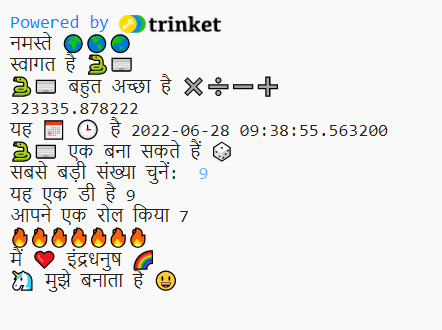

## सेंटेंस स्टार्टर

अपने प्रोजेक्ट से अधिक वाक्य आउटपुट करें।

{:width="300px"} 

--- task ---

अपने कोड में और `print` लाइनें जोड़ें। यहां कुछ प्रारंभकर्ता वाक्य हैं जिनका आप उपयोग कर सकते हैं:

--- code ---
---
language: python filename: main.py line_numbers: true line_number_start: 29
line_highlights: 30-32
---

roll_dice()  # Call the roll dice function print('I ❤️ ...')   
print('... makes me 😃')   
print('I\'d like to make ... with', python)

--- /code ---

**टिप:** `प्रिंट` का प्रत्येक उपयोग बीच में एक पंक्ति जोड़ता है।

**टिप:** यदि आपको एक एपोस्ट्रोफी `'` प्रिंट करने की आवश्यकता है, तो आपको एक बैकस्लैश `\` डालना होगा ताकि Python इसे टेक्स्ट का हिस्सा समझ सके।

**Tip:** Add a `#` at the beginning of a line to turn it into a comment.

--- /task ---

पीला दिल इमोजी 💛 का उपयोग अक्सर दोस्ती और खुशी दिखाने के लिए किया जाता है।

--- task ---

आप किसी मित्र को खुश करने के लिए कौन सा संदेश भेजेंगे? आप कौन सा इमोजी चुनेंगे?

आप जिन इमोजी और उदाहरण वेरिएबल का उपयोग कर सकते हैं उन्हें देखने के लिए कोड संपादक में **इमोजी** अनुभाग तक स्क्रॉल करें। जिन्हें आप चुनते हैं उन्हें कॉपी करें और उन्हें एक वेरिएबल में सहेजें या सीधे अपने कोड में जोड़ें।

आप **इमोजी** अनुभाग में अधिक इमोजी जोड़ सकते हैं। जिन्हें आप चाहते हैं उन्हें ढूंढने के लिए इस [इमोजी सूची](https://unicode.org/emoji/charts/full-emoji-list.html){:target='_blank'} का उपयोग करें।

🎊 🙌 🙌🏼 🙌🏽 🙌🏾 🙌🏿 😃 🕒 🎨 🎮 🔬 🎉 🕶️ 🎲 😊 🦄 🚀 💯 ⭐ 💛 ❤️ 📚 ⚽ 🏏 🏀 🥋 🏆 ✨ 🥺 🌈 🔥 ♻️ 🌳 👩‍🦽👩🏼‍🦽👩🏽‍🦽👩🏾‍🦽👩🏿‍🦽🧘 🧘🏼 🧘🏽 🧘🏾 🧘🏿 🙋 🙋🏼 🙋🏽 🙋🏾 🙋🏿

[[[choose-an-emoji]]]

--- /task ---

--- save ---
