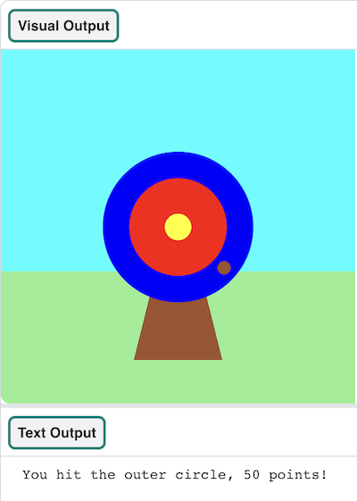

## आगे क्या?

यदि आप [Introduction to python](https://projects.raspberrypi.org/en/raspberrypi/python-intro) मार्ग का अनुसरण कर रहे हैं, तो आप [Target practice](https://projects.raspberrypi.org/en/projects/target-practice) प्रोजेक्ट पर जा सकते हैं। इस परियोजना में, आप एक लक्ष्य बनाएंगे और फिर एक तीरंदाजी खेल बनाएंगे जो अंक हासिल करने के लिए तीर चलाता है।

--- print-only ---

{:width="640px"}

--- /print-only ---

--- no-print ---

Click the **Run** button to view an example of this project.

<iframe src="https://editor.raspberrypi.org/en/embed/viewer/target-practice-solution" width="600" height="600" frameborder="0" marginwidth="0" marginheight="0" allowfullscreen>
</iframe>

--- /no-print ---

If you want to have more fun exploring Python, then you could try out any of [these projects](https://projects.raspberrypi.org/en/projects?software%5B%5D=python).
