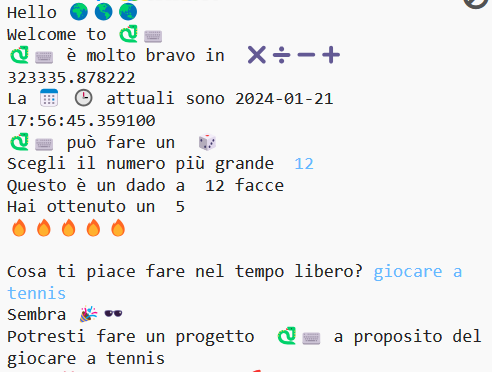

  <a class="c-survey-banner__link" href="https://form.raspberrypi.org/f/code-editor-feedback" target="_blank">Partecipa al nostro sondaggio</a> per aiutarci a migliorare il nostro editor di codice!

## Quello che farai

Scopri cosa può fare il linguaggio di programmazione Python 🐍 scrivendo un progetto interattivo che utilizza emoji 🙌 🙌🏼 🙌🏽 🙌🏾 🙌🏿.

**Emoji** sono piccole immagini colorate 🥰 utilizzate per aggiungere ulteriore significato ai messaggi. Emoji significa "parola illustrata" in giapponese.

Tu:

+ `print()` testo, inclusi gli emoji 🚀, e ottieni un `input()` ⌨️ dall'utente
+ Memorizza testo e numeri nelle **variabili**
+ Usa le **funzioni** per organizzare il tuo codice

--- no-print ---

### Play ▶️

--- task ---

  

Fai clic sul pulsante **Run** e leggi l'output.

  Quando ti viene richiesto, digita un numero e premi<kbd>Invio</kbd>. 

Riesci a vedere come vengono utilizzate le tue risposte?

<iframe src="https://editor.raspberrypi.org/en/embed/viewer/hello-world-solution" width="600" height="600" frameborder="0" marginwidth="0" marginheight="0" allowfullscreen>
</iframe>

--- /task ---

--- /no-print ---

--- print-only ---

{:width="640px"}

--- /print-only --- 