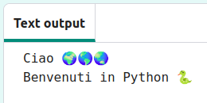
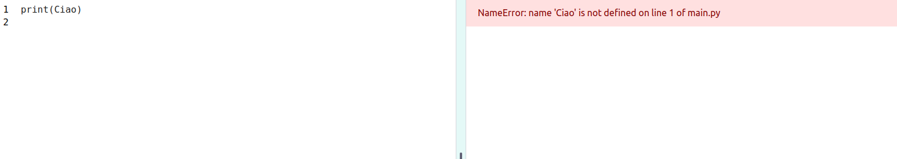
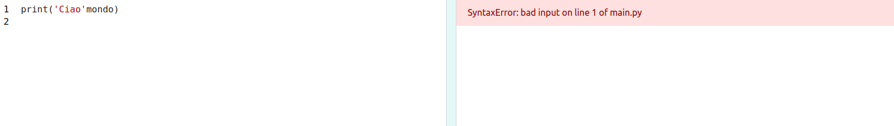

## Dire Ciao

<div style="display: flex; flex-wrap: wrap">
<div style="flex-basis: 200px; flex-grow: 1; margin-right: 15px;">
Quando impari un nuovo linguaggio di programmazione è consuetudine scrivere un programma che visualizzi il messaggio 'Ciao Mondo!' (Hello World).
</div>
<div>

{:width="200px"}

</div>
</div>

--- task ---

Apri il progetto di partenza [Ciao 🌍🌎🌏](https://editor.raspberrypi.org/it-IT/projects/hello-world-starter){:target="_blank"}. L'editor si aprirà in un'altra scheda del browser.


Se disponi di un account Raspberry Pi, puoi fare clic sul pulsante **Salva** per salvarne una copia nei tuoi **Progetti**.

--- /task ---

--- collapse ---

---
title: Stai lavorando su un Raspberry Pi?
---

Se stai lavorando su un Raspberry Pi utilizzando Chromium, potresti non vedere le emoji. È necessario installare un carattere che le supporti.

Apri un terminale e poi digita:

```bash
sudo apt install fonts-noto-color-emoji
```

Riavvia Chromium e dovresti vedere le emoji colorate.

--- /collapse ---

### Stampa ciao

<p style="border-left: solid; border-width:10px; border-color: #0faeb0; background-color: aliceblue; padding: 10px;">
Le linee che cominciamo con un `#` sono <span style="color: #0faeb0">**commenti**</span>. Spiegano cosa farà il codice. I commenti vengono ignorati da Python.
</p>

Le righe `import` all'inizio del codice indicano a Python che utilizzerai codice che non hai scritto tu.

In Python, `print()` visualizza testo (parole o numeri) sullo schermo.

--- task ---

Trova la riga di codice `# Inserisci il codice da eseguire qui sotto`.

Fai clic sotto quella riga. Il `|` lampeggiante è il cursore e mostra dove digiterai.

--- /task ---

--- task ---

Digita il codice per fare `print()` di Ciao sullo schermo:

**Suggerimento:** Quando si digita una parentesi di apertura `(` o un apostrofo di apertura `'` l'editor del codice aggiungerà automaticamente una parentesi di chiusura `)` o un apostrofo di chiusura`'`:

--- code ---
---
language: python
filename: main.py
line_numbers: true
line_number_start: 17
line_highlights: 18
---

# Metti il codice da eseguire qui sotto
print('Ciao')

--- /code ---

--- collapse ---
---
title: Digitare caratteri speciali su una tastiera Italiana
---

Su una tastiera italiana, le parentesi tonde sinistra `(` e destra `)` si trovano sui tasti <kbd>8</kbd> e <kbd>9</kbd>. Per digitare una parentesi tonda sinistra, tieni premuto il tasto <kbd>Maiusc</kbd> (accanto a <kbd>Z</kbd>) e quindi tocca <kbd>8</kbd>. La virgoletta singola `'` si trova sulla stessa riga dei numeri, a destra dello <kbd>0</kbd>, appena prima del tasto <kbd>Cancella</kbd>. La virgola `,` è accanto alla lettera <kbd>M</kbd>.

--- /collapse ---

--- /task ---

--- task ---

**Prova:** Fai clic sul pulsante **Run** per eseguire il tuo codice. Nell'editor del codice, l'output apparirà sulla destra:


**Debug:** Se ricevi un errore, controlla il codice con molta attenzione. In questo esempio, mancano le virgolette singole attorno `Ciao`, quindi Python non capisce che dovrebbe essere testo.



--- /task ---

## Stampa🌍🌎🌏

In Python, una **variabile** viene utilizzata per memorizzare valori come testo o numeri. Le variabili rendono più semplice per gli esseri umani leggere il codice. Puoi utilizzare la stessa variabile in molti punti del tuo codice. Scegliere un nome sensato per una variabile rende più facile ricordare a cosa serve.

Abbiamo incluso alcune variabili che memorizzano i caratteri emoji.

--- task ---

Nel tuo codice, scorri fino alle righe con le emoji salvate in due diverse variabili. Trova la variabile `mondo`, che memorizza il testo '🌍🌍🌍'.

--- /task --- 

--- task ---

Puoi fare `print()` di più di un elemento alla volta includendo una virgola `,` tra gli elementi. `print()` aggiungerà uno spazio tra ogni elemento.

Cambia il tuo codice per fare `print()` anche del contenuto della variabile `world`:

--- code ---
---
language: python
filename: main.py
line_numbers: true
line_number_start: 17
line_highlights: 18
---

# Metti il codice da eseguire qui sotto
print('Ciao', mondo)

--- /code ---

**Suggerimento:** `'Ciao'` è una stringa di testo perché è racchiusa tra virgolette singole, mentre `mondo` è una variabile, quindi il valore memorizzato in essa verrà stampato.

--- /task ---

--- task ---

**Prova:** Esegui il codice per vedere il risultato:


**Suggerimento:** Le emoji possono avere un aspetto diverso su computer diversi, quindi le tue potrebbero non essere esattamente lo stesso.

**Debug:** Assicurati di aver aggiunto una virgola tra gli elementi in `print()` e di aver scritto correttamente `mondo`.

In questo esempio manca la virgola `,`. È piccola ma molto importante!



--- /task ---

--- task ---

**Aggiungi** un'altra riga al tuo codice `print()` altri testi ed emoji:

--- code ---
---
language: python
filename: main.py
line_numbers: true
line_number_start: 18
line_highlights: 19
---

print('Ciao', mondo)    
print('Benvenuti in', python)

--- /code ---

**Suggerimento:** Il codice che devi digitare è evidenziato in un colore più chiaro. Il codice non evidenziato ti aiuta a trovare dove devi aggiungere il nuovo codice.

--- /task ---

--- task ---

**Prova:** Clicca **Esegui**.


**Suggerimento:** È una buona idea eseguire il codice dopo ogni modifica in modo da poter risolvere rapidamente i problemi.

**Debug:** Controlla attentamente la presenza di parentesi, virgolette, virgole e l'ortografia corretta. Python ha bisogno che tu sia veramente preciso.

--- /task ---

Se disponi di un account Raspberry Pi, puoi fare clic sul pulsante **Salva** per salvarne una copia nei tuoi progetti.

--- save ---
