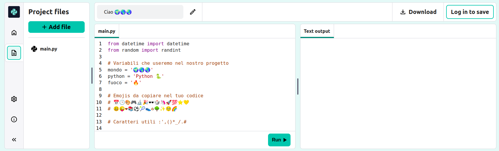
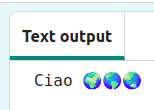

## Stampa ciao

In Python, `print()`{:.language-python} outputs strings (words or numbers) to the screen.

--- task ---

Apri il progetto di partenza [Ciao 🌍🌎🌏](https://editor.raspberrypi.org/en/projects/hello-world-starter){:target="_blank"}. L'editor si aprirà in un'altra scheda del browser.

--- /task ---

--- task ---

Find the `# Put code to run below here`{:.language-python} line.

Click below that line. The flashing `|` is the cursor and shows where you will type.

--- /task ---

--- task ---

Type the code to `print()`{:.language-python} Hello to the screen:

--- code ---
---
language: python line_numbers: true line_number_start: 17
line_highlights: 18
---
# Put code to run under here.
print(f'Hello')

--- /code ---

--- /task ---

--- task ---

**Prova:** Fai clic sul pulsante **Run** per eseguire il tuo codice. This is what you should see when you run your code:

--- /task ---

A **variable** is used to store values such as text or numbers. Abbiamo incluso alcune variabili che memorizzano i caratteri emoji.

--- task ---

Change your code to also `print()`{:.language-python} the contents of the `world`{:.language-python} variable. You can do this by adding the variable name in curly brackets `{}`{:.language-python}

--- code ---
---
language: python line_numbers: true
line_number_start: 17
---
# Metti il codice da eseguire qui sotto
print(f'Hello {world}')

--- /code ---

The `f`{:.language-python} character inside the print lets you easily print variables along with strings of text.

--- /task ---

--- task ---

**Prova:** Esegui il codice per vedere il risultato:

--- /task ---

--- task ---

**Add** another line to your code to `print()`{:.language-python} more text and emojis:

--- code ---
---
language: python line_numbers: true line_number_start: 17
line_highlights: 19
---
# Put code to run under here
print(f'Hello {world}') print(f'Welcome to {python}')

--- /code ---

--- /task ---

--- task ---

**Prova:** Clicca **Esegui**.

**Suggerimento:** È una buona idea eseguire il codice dopo ogni modifica in modo da poter risolvere rapidamente i problemi.

--- /task ---

