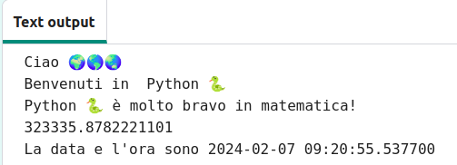

## Somme e date

Python è bravissimo a lavorare con numeri e date.

{:width="300px"} 

In Python puoi usare gli operatori matematici per fare somme:

| + | aggiungere |   
| - | sottrarre |   
| * | moltiplicare |   
| / | dividere |   
| ** | elevare a potenza |

### Crea un calcolo

--- task ---

Aggiungi altre due righe `print()` al tuo codice inclusa una somma da far calcolare a Python:

**Suggerimento:** Il simbolo `*` si trova nella parte destra della tastiera sul tasto `+`.

--- code ---
---
language: python
filename: main.py
line_numbers: true
line_number_start: 18
line_highlights: 20-21
---

print('Ciao', mondo)   
print('Benvenuto in', python)   
print(python, 'è molto bravo in matematica!')   
print(230 * 5782 ** 2 / 23781)  # Stampa il risultato dell'operazione

--- /code ---

**Suggerimento:** Non è necessario digitare i commenti, sono lì solo per aiutarti a capire il codice. Basta digitare il codice prima dello `#`.

--- /task ---

--- task ---

**Prova:** Esegui il codice. Python ha effettuato correttamente il calcolo? Era uno scherzo! Python fa i calcoli difficili per te, quindi non è necessario risolverli.

**Debug:**

--- collapse ---
---
title: Ho un syntax error
---

`Debug:` Assicurati di aver aggiunto una virgola tra gli elementi in `print()` e di aver scritto correttamente `mondo`.

--- /collapse ---

--- /task ---

L'informatica giapponese **Emma Haruka Iwao** ha utilizzato un computer per calcolare il valore di Pi greci (*π*) composto da 31 trilioni di cifre. La risposta è così lunga che ci vorrebbero più di 300.000 anni solo per dirla!

--- task ---

Prova a cambiare i calcoli fatti da Python fa in altri più complicati!

Puoi anche usare le parentesi se vuoi controllare l'ordine in cui Python calcola la somma: `print( (2 + 4) * (5 + 3) )`.

--- /task ---

--- task ---

**Prova:** Esegui il tuo codice e chiedi a Python di risolvere l'operazione per te.

**Debug:** Assicurati che la tua operazione abbia una parentesi tonda sinistra e destra attorno ad essa `( 2 * 45 )`. Se utilizzi parentesi extra per controllare l'ordine, assicurati di avere una parentesi destra che corrisponda a ogni parentesi sinistra.

--- /task ---

--- task ---

Nell'editor di codice, potresti trovare che il testo è troppo grande o troppo piccolo per essere letto senza fatica. Puoi facilmente modificare queste impostazioni in base alle tue preferenze.

**Suggerimento:** Fai clic sul menu **Impostazioni**  a sinistra dell'editor di codice. Quindi fare clic su uno qualsiasi dei pulsanti **Dimensione testo** per modificare la dimensione del testo.

Puoi anche passare da una modalità colore all'altra, clicca sui pulsanti **Chiaro & Scuro** per vedere le modifiche.

--- /task ---

La riga `from datetime import *` nella parte superiore della scheda **main.py** serve ad importare una libreria con funzioni utili per ottenere la data e l'ora correnti.

Una delle cose migliori di Python sono tutte le **librerie** di codice disponibili per l'uso. Una libreria Python ti consente di utilizzare facilmente il codice scritto da altre persone. Sono disponibili librerie per disegnare diagrammi e grafici, creare disegni, eseguire calcoli e molto altro ancora.

--- task ---

Aggiungi un'altra riga al tuo codice per `stampare` la data e l'ora correnti.

Ottieni la data e l'ora correnti utilizzando la funzione `now()` dalla libreria `datetime`:

--- code ---
---
language: python
filename: main.py
line_numbers: true
line_number_start: 20
line_highlights: 22
---

print(python, 'è molto bravo in matematica!')    
print(230 * 5782 ** 2 / 23781) # Stampa il risultato della somma     
print('La data e l\'ora sono', datetime.now()) # Stampa la data e l'ora correnti

--- /code ---

Per stampare un apostrofo `'` in una parola, metti una barra rovesciata `\` prima in modo che Python sappia che fa parte del testo.

**Suggerimento:** Non è necessario digitare i commenti, sono lì solo per aiutarti a capire il codice. Basta digitare il codice prima dello `#`.

--- /task ---

--- task ---

**Prova:** Esegui il codice un paio di volte per vedere l'aggiornamento dell'ora.

**Debug:** Controlla di avere inserito un punto `.` tra `datetime` e `now`. Controlla attentamente tutta la punteggiatura.

--- /task ---

--- save ---
