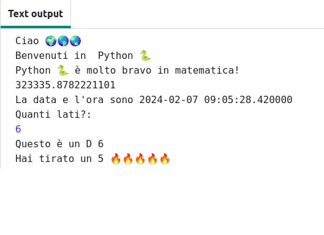

## Lancia un dado 🎲

Crea una funzione per lanciare un dado utilizzando numeri casuali. 
  
In Python:
  - **funzioni**, definite con `def`, sono come 'i miei blocchi' in Scratch,
  - `randint` è come 'casuale' in Scratch e
  - `input` è come 'chiedi' a Scratch.

{:width="300px"} 

In Python **chiami** una **funzione()** per eseguire un'azione. Hai già utilizzato la funzione `print()` per visualizzare del testo.

È possibile **definire** una nuova **funzione** per raggruppare il codice così da poterlo denominare e riutilizzare.

### Definisci la tua funzione

--- task ---

Le funzioni devono essere definite prima che tu possa richiamarle. Cerca il commento nel file **main.py** che dice `# Definizioni di funzioni`.

Definire una nuova funzione chiamata `tira_dado()` che utilizza la funzione `randint()` dalla libreria `random`, per generare un "integer" (un numero intero) casuale da 1 a 6 e visualizzarlo sullo schermo.

--- code ---
---
language: python filename: main.py line_numbers: true line_number_start: 15
line_highlights: 16-17
---

# Definizioni di funzioni
def tira_dado(): # Non dimenticare i due punti alla fine di questa riga   
print('Hai ottenuto un ', randint(1, 6)) # randint(1, 6) viene utilizzato per fornire un numero compreso tra 1 e 6.

--- /code ---

La riga sotto `def tira_dado():` è **indentata (rientrata)**. Per fare ciò, usa il tasto<kbd>Tab</kbd> sulla tastiera (di solito sopra <kbd>Blocca Maiuscole</kbd> sulla tastiera). Il codice rientrato dice a Python che le righe rientrate fanno parte della funzione.

**Suggerimento:** Il carattere di sottolineatura (underscore) `_` viene utilizzato tra le parole nei nomi di variabili e funzioni in Python per renderli più facili da leggere. Non puoi utilizzare uno spazio.

--- collapse ---
---
title: Digitare caratteri speciali su una tastiera Italiana
---

Su una tastiera italiana, i due punti `:` si trovano sullo stesso tasto del punto, accanto al tasto <kbd>M</kbd>: tieni premuto <kbd>Shift</kbd> e tocca <kbd>.</kbd> per digitare `:`. Il carattere di sottolineatura `_` si trova sullo stesso tasto di `-`, accanto a <kbd>.</kbd>, tieni premuto <kbd>Shift</kbd> e premi<kbd>-</kbd> per digitare `_`.

--- /collapse ---

--- /task ---

--- task ---

**Prova:** Se esegui "Esegui" il codice ora, non lancerà un dado. Questo perché hai definito la funzione `tira_dado()`, ma non l'hai ancora chiamata.

**Debug:**

--- collapse ---
---
title: Ho un syntax error
---

- Assicurati di avere un carattere di sottolineatura `_` tra tira e dado per creare il nome della funzione.

- Assicurati di avere i due punti `:` alla fine della riga.

- Controlla che la riga sotto `tira_dado()` sia rientrata. È un errore abbastanza comune in Python, quindi assicurati di controllare.

--- /collapse ---

--- /task ---

### Chiama la tua funzione

--- task ---

Per utilizzare una funzione è necessario **chiamarla** nel codice. Vai alla fine del tuo codice e aggiungi una nuova riga per chiamare la funzione `tira_dado()`:

--- code ---
---
language: python filename: main.py line_numbers: true line_number_start: 25
line_highlights: 27
---

print('La data e l'ora attuali sono', datetime.now())

tira_dado() # Chiama la funzione lancia_un_dado

--- /code ---

--- /task ---

--- task ---

**Prova:** Esegui il tuo progetto più volte per vedere come ogni volta il risultato del lancio dei dadi sia casuale.

--- /task ---

I numeri casuali sono utilizzati nella crittografia, in informatica e per aggiungere una maggior varietà ai giochi e alla computer art. I computer generano **numeri casuali** utilizzando un algoritmo. Per generare numeri veramente casuali, è necessario utilizzare un input imprevedibile dal mondo reale.

### Usa 🔥🔥🔥 per il numero ottenuto

--- task ---

La tua funzione può utilizzare la variabile 🔥 emoji. Il codice `print(fuoco * 3)` visualizza tre emoji di fuoco '🔥🔥🔥'. Devi produrre il numero corretto di emoji in modo che corrisponda al numero casuale ottenuto dal lancio dei dadi.

Modifica il tuo codice per salvare il valore restituito da `randint()` in una variabile chiamata `risultato`. Usa quella variabile per stampare il numero lanciato con il numero corrispondente di emoji🔥 .

--- code ---
---
language: python filename: main.py line_numbers: true line_number_start: 15
line_highlights: 17-18
---

# Definizioni di funzioni
def tira_dado(): risultato = randint(1, 6) # Genera un numero casuale tra 1 e 6 e lo memorizza nella variabile 'risultato' print('Hai ottenuto un', risultato, fuoco * risultato) # Ripete l'operazione emoji del fuoco per abbinarla al numero ottenuto con i dadi

--- /code ---

**Suggerimento** Puoi usare una `stella` o un `cuore` invece del `fuoco` se preferisci, e creare così le tue variabili emoji.

--- /task ---

--- task ---

**Prova:** Testa il tuo progetto alcune volte. Assicurati di capire come funziona il codice.

--- /task ---

### Scegli il numero di facce del dado

Migliora i tuoi dadi in modo che l'utente possa scegliere il numero massimo.

Molti giochi utilizzano dadi a molte facce. Nel mondo fisico, i dadi sono costituiti da forme geometriche regolari. I dadi comuni hanno 6, 12 e 20 facce. Su un computer, puoi generare un numero casuale per creare un dado con qualsiasi numero di facce.

--- task ---

La funzione `input()` pone una domanda all'utente e quindi memorizza la risposta.

**Aggiungi** del codice per chiedere all'utente quale deve essere il numero più grande dei sui suoi dadi e poi salva quel numero in una variabile chiamata `massimo` e `visualizza` il numero scelto nell'area di output:

Cambia il codice che genera la tua variabile `risultato` utilizzando `massimo` come valore massimo per `randint` quando genera un numero casuale.

Quando ricevi un input dall'utente, Python lo tratta come se fosse testo. Ma `randint` necessita di un "integer" (un numero intero positivo). La funzione `int` trasforma l'input dell'utente in un numero intero.

--- code ---
---
language: python filename: main.py line_numbers: true line_number_start: 15
line_highlights: 18-20
---

# Definizioni di funzioni

def tira_dado():   
massimo = input('Quante facce ha il dado?:')  # Aspetta l'input dell'utente    
print('Questo è un dado D', massimo)  # Usa il numero inserito dall'utente    
risultato = randint(1, int(massimo))  # Usa max per stabilire il numero di facce del dado print('Hai ottenuto un ', risultato, fuoco * risultato)

--- /code ---

Per stampare un apostrofo `'` in una parola, metti una barra rovesciata `\` prima in modo che Python sappia che fa parte del testo.

--- /task ---

--- task ---

**Prova:** Esegui il codice. Quando il programma arriva alla riga `input` , attenderà che tu inserisca una risposta prima di continuare. Digita la tua risposta e quindi premi <kbd>Invio</kbd>, ciò consentirà al programma di memorizzare la tua risposta. Riprova con un diverso numero in `input`.

--- /task ---

--- save ---
