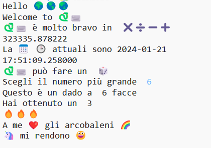

## Frasi di partenza

Produci più frasi dal tuo progetto.

{:width="300px"} 

--- task ---

Aggiungi altri `print` al tuo codice. Per iniziare, ecco alcune frasi che puoi utilizzare:

--- code ---
---
language: python filename: main.py line_numbers: true line_number_start: 29
line_highlights: 30-32
---

lancia_un_dado() # Chiama la funzione lancia dadi print('Io ❤️ ...')   
print('... mi rende 😃')   
print('Mi piacerebbe fare... con' , python)

--- /code ---

**Suggerimento:** Ogni volta che esegui un `print` viene aggiunta una linea in mezzo.

**Suggerimento:** Se devi stampare un apostrofo `'` allora devi mettere una barra rovesciata `\` prima di esso in modo che Python sappia che fa parte del testo.

**Suggerimento:** Aggiungi `#` all'inizio di una riga per trasformarla in un commento.

--- /task ---

L'emoji del cuore giallo 💛 è spesso usato per mostrare amicizia e felicità.

--- task ---

Quale messaggio manderesti a un amico per tirarlo su di morale? Quale emoji sceglieresti?

Scorri fino alla sezione **emoji** nell'editor del codice per vedere gli emoji e le variabili di esempio che puoi utilizzare. Copia quelli che scegli e salvali in una variabile o aggiungili direttamente al tuo codice.

Puoi aggiungere altre emoji alla sezione **emoji**. Usa questo elenco di [emoji](https://unicode.org/emoji/charts/full-emoji-list.html){:target="_blank"} per trovare quelli che desideri.

🎊 🙌 🙌🏼 🙌🏽 🙌🏾 🙌🏿 😃 🕒 🎨 🎮 🔬 🎉 🕶️ 🎲 😊 🦄 🚀 💯 ⭐ 💛 ❤️ 📚 ⚽ 🏏 🏀 🥋 🏆 ✨ 🥺 🌈 🔥 ♻️ 🌳 👩‍🦽👩🏼‍🦽👩🏽‍🦽👩🏾‍🦽👩🏿‍🦽🧘 🧘🏼 🧘🏽 🧘🏾 🧘🏿 🙋 🙋🏼 🙋🏽 🙋🏾 🙋🏿

[[[choose-an-emoji]]]

--- /task ---

--- save ---
