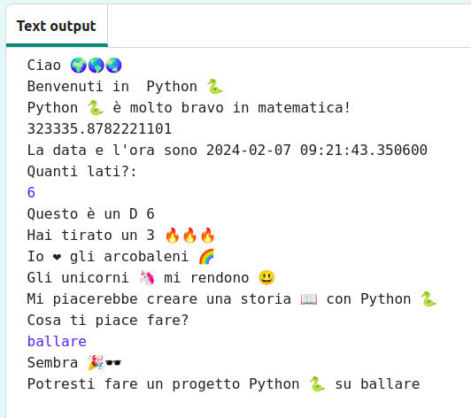

## Migliora il tuo progetto

Aggiungi altro al tuo progetto. Ci sono più emoji tra cui scegliere.
  

{:width="300px"} 

Potresti:
+ Usa `print` con testo ed emoji diversi
+ Utilizzare `input` per ottenere valori dall'utente e memorizzarli come variabili, quindi esegui calcoli con le variabili
+ Usa le funzioni per organizzare il tuo codice
+ Usa `#` per aggiungere commenti al tuo codice

Scorri fino alla sezione **emoji** nell'editor del codice per vedere gli emoji e le variabili di esempio che puoi utilizzare. Copia quelli che scegli e salvali in una variabile o aggiungili direttamente al tuo codice.

**Suggerimento:** Per aggiungere emoji, trova il commento # Emoji da copiare e incollare nel tuo codice. Copia gli emoji che desideri utilizzare e incollali nel tuo codice.

🎊 🙌 🙌🏼 🙌🏽 🙌🏾 🙌🏿 # 😃 🕒🎨🎮🔬🎉🕶️🎲 😊 🦄🚀💯⭐💛❤️📚⚽🏏🏀🥋🏆✨🥺🌈🔥♻️🌳 👩‍🦽👩🏼‍🦽👩🏽‍🦽👩🏾‍🦽👩🏿‍🦽🧘 🧘🏼 🧘🏽 🧘🏾 🧘🏿 🙋🙋🏼🙋🏽🙋🏾🙋🏿

[[[choose-an-emoji]]]

Ecco una funzione di esempio che chiede informazioni sugli hobby:

--- code ---
---
language: python
filename: main.py
---

# Metti il codice da eseguire qui sotto
def hobbies():   
hobby = input('Cosa ti piace?')   
print('Sembra', divertente) # Dovrai creare una variabile emoji chiamata 'divertente' print('Potresti creare un progetto Python, ' su', hobby)

--- /code ---

**Suggerimento:** Non dimenticare che dovrai chiamare la tua funzione oltre a definirla.

Puoi usare `input` per fare in modo che il tuo progetto attenda che l'utente premi <kbd>Invio</kbd> in qualsiasi punto di questo progetto.

--- code ---
---
language: python
filename: main.py
---

tira_dado()

input() # Attendi che l'utente prema Invio

hobbies() # Chiama la funzione hobbies

--- /code ---

--- collapse ---
---
title: Il progetto completo
---

Qui puoi visualizzare il [progetto completat](https://editor.raspberrypi.org/en/projects/hello-world-solution){:target="_blank"}.

--- /collapse ---

--- save ---
