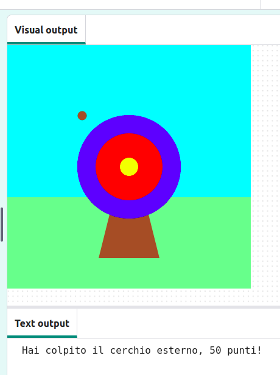

## E adesso?

Se stai seguendo il percorso [Introduzione a Python](https://projects.raspberrypi.org/en/raspberrypi/python-intro) , puoi passare al progetto [Esercitati con il bersaglio](https://projects.raspberrypi.org/en/projects/target-practice) . In questo progetto disegnerai un bersaglio e poi realizzerai un gioco di tiro con l'arco che scaglia frecce per segnare punti.

--- print-only ---

{:width="640px"}

--- /print-only ---

--- no-print ---

Fare clic sul pulsante **Esegui** per visualizzare un esempio di questo progetto.

<iframe src="https://editor.raspberrypi.org/en/embed/viewer/target-practice-solution" width="600" height="600" frameborder="0" marginwidth="0" marginheight="0" allowfullscreen>
</iframe>

--- /no-print --- If you want to have more fun exploring Python, then you could try out any of [these projects](https://projects.raspberrypi.org/en/projects?software%5B%5D=python).
