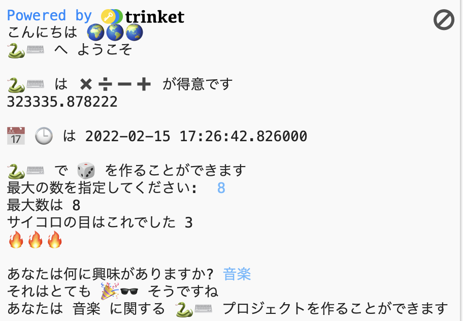

## You will make

絵文字を使用するインタラクティブなプロジェクトを作成して、Pythonプログラミング言語で何ができるかを確認してください。

**絵文字**は、メッセージに特別な意味を追加するために使用される小さくてカラフルな画像です。 英語のEmojiは日本語の「絵文字」です。

次のことを行います。
+ 絵文字を含むテキストを表示(`print()`)し、ユーザーから入力(`input()`)を得る
+ テキストや数値を**変数**に格納する
+ **関数**を使用してコードを整理する

--- no-print ---

### Play ▶️

--- task ---

  
出力された文を読み、<kbd>Enter</kbd>をたたいて続行します。 
質問への返答を入力します。 あなたの答えがどのように使われているのか分かりますか？

  <iframe src="https://trinket.io/embed/python/a54e164ac2?outputOnly=true&start=result" width="600" height="500" frameborder="0" marginwidth="0" marginheight="0" allowfullscreen>
  </iframe>
  

--- /task ---

--- /no-print ---

--- print-only ---

--- /print-only ---

