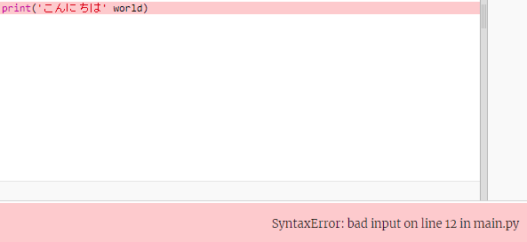

## こんにちはと言う

<div style="display: flex; flex-wrap: wrap">
<div style="flex-basis: 200px; flex-grow: 1; margin-right: 15px;">
新しいプログラミング言語を学ぶとき、伝統的に「Hello world!」(ハローワールド！)と出力するプログラムを作成します。
</div>
<div>

{:width="200px"}

</div>
</div>

--- task ---

[こんにちは 🌍🌎🌏 基本プロジェクト](https://trinket.io/python/a7fcb2ede7){:target="_blank"}を開きます。 Trinketは別のブラウザタブで開きます。


If you have a Raspberry Pi account, you can click on the **Save** button to save a copy to your **Projects**.

--- /task ---

--- collapse ---

---
title: Working on a Raspberry Pi?
---

If you're working on a Raspberry Pi using Chromium, you may not see the emojis. You need to install a font that supports them.

Open a terminal and then type:

```bash
sudo apt install fonts-noto-color-emoji
```

Restart Chromium and you should see the colour emojis.

--- /collapse ---

### from noemoji import *

<p style="border-left: solid; border-width:10px; border-color: #0faeb0; background-color: aliceblue; padding: 10px;">
Lines beginning with a `#` are <span style="color: #0faeb0">**comments**</span>. They explain what the code will do. Comments are ignored by Python.
</p>

`#`で始まる行はコメントで、コードを人間に説明するために書きますが、Pythonは無視します。

Pythonでは、 `print()`はテキスト（言葉や数字）を画面に出力します。

--- task ---

`# 動かしたいコードをこの下に書く`の行を探します。

その行の下をクリックします。 点滅する`|`はカーソルで、文字入力する場所を示しています。

--- /task ---

--- task ---

こんにちはを表示(`print()`)するコードを入力します。

**main.py**タブをクリックして`print()`コードに戻ります。

--- code ---
---
language: python filename: main.py line_numbers: true line_number_start: 11
line_highlights: 12
---

# 動かしたいコードをこの下に書く
print('こんにちは')

--- /code ---

--- collapse ---
---
title: 英国または米国のキーボードで特殊文字を入力する
---

英国または米国のキーボードでは、左丸括弧`(`および右丸括弧`)` は<kbd>9</kbd>と<kbd>0</kbd>のキーにあります。 左丸括弧を入力するには、（<kbd>Z</kbd>の横にある）<kbd>Shift</kbd>キーを押したまま<kbd>9</kbd>をたたきます。 引用符`'`は<kbd>L</kbd>キーと同じ行の、 <kbd>Enter</kbd>キーの直前にあります。 コンマ`,`は<kbd>M</kbd>の隣にあります。

--- /collapse ---

--- /task ---

--- task ---

**テスト：** **Run**ボタンをクリックしてコードを実行します。 Trinketでは、出力は右側に表示されます。


**デバッグ：**エラーが発生した場合は、コードを注意深く確認してください。 この例では、 `こんにちは`の前後の引用符が抜けているため、Pythonはそれがテキストだということが分かりません。


--- /task ---

## Print 🌍🌎🌏

Pythonでは、**変数**を使用してテキストまたは数値を格納します。 変数は人間がコードを読むのを簡単にしてくれます。 コード内の多くの場所で同じ変数を使用できます。 Choosing a sensible name for a variable makes it easier for you to remember what it is for.

絵文字を格納する変数をいくつか含めました。

--- task ---

`from emoji import *`行を以下のように変更します。 変数`world`を探してください。 「🌍🌍🌍」というテキストが格納されています。

--- /task ---

--- task ---

一度に複数のアイテムを`print()`するには、アイテムの間にコンマ`,`を入れます。 `print()`は、各アイテムの間にスペースを追加します。

コードを変更して、変数`world`の内容も`print()`します。

--- code ---
---
language: python filename: main.py line_numbers: true line_number_start: 11
line_highlights: 3
---

# 動かしたいコードをこの下に書く
print('こんにちは', world)

--- /code ---

**ヒント：**`'こんにちは'`は一重引用符で囲まれているためテキスト文字列ですが、`world` は変数であるため、そこに格納されている値が出力されます。

--- /task ---

--- task ---

**テスト：**コードを実行して、結果を確認します。


**Tip:** Emojis can look different on different computers, so yours might not look exactly the same.

**デバッグ：**`print()`のアイテムの間にコンマを追加していること、`world`のスペルが正しいことを確認してください。

この例では、コンマ`,`がありません。 小さなことですがとても重要です！



--- /task ---

--- task ---

コードに別の行を追加して、ほかのテキストや絵文字を`print()`します。

--- code ---
---
language: python filename: main.py line_numbers: true line_number_start: 12
line_highlights: 13
---

print('こんにちは', world)    
print(python, 'へ ようこそ')

--- /code ---

**ヒント：**入力する必要のあるコードは、明るい色で強調表示されています。 強調表示されていないコードを見て、新しいコードを追加する必要がある場所を見つけることができます。

--- /task ---

--- task ---

**テスト：****Run**をクリックします。


**ヒント：**問題をすばやく修正できるように、変更のたびにコードを実行することをお勧めします。

**デバッグ：**角かっこ、引用符、コンマ、および正しいスペルを注意深く確認します。 Pythonはあなたが本当に正確であることを求めます。

--- /task ---

If you have a Raspberry Pi account, on your code editor you can click on the **Save** button to save a copy of your project to your Projects.

--- save ---
