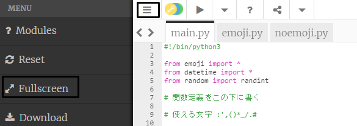

## 計算と日付

Pythonは、数値と日付の処理に優れています。

{:width="300px"}

Pythonでは、数学演算子を使用して計算を行うことができます。

| + | 足し算 |   
| - | 引き算 |   
| * | 掛け算 |   
| / | 割り算 |   
| ** | べき乗 |

--- task ---

Pythonが行う計算を含む`print()`行をもう2行、コードに追加します。

--- code ---
---
language: python filename: main.py line_numbers: true line_number_start: 12
line_highlights: 14-15
---

print('こんにちは', world)   
print(python, 'へ ようこそ')   
print(python, 'は', sums, 'が得意です')   
print(230 * 5782 ** 2 / 23781)

--- /code ---

--- /task ---

--- task ---

**テスト：**コードを実行します。 Pythonは正しく計算しましたか？ ほんの冗談です！ Pythonが難しい計算をやってくれるので、あなたがする必要はありません。

--- /task ---

日本のコンピューター科学者**岩尾エマはるか**は、コンピューターを使用して円周率（*π*）の値を31兆桁まで計算しました。 その答えは非常に長いので、それを言うだけでも30万年以上かかります！ 

--- task ---

Pythonが行う計算を複雑なものに変更してみてください！

Pythonが計算する順序を制御するために、`print((2 + 4) * (5 + 3))`のようにかっこを使うこともできます。

--- /task ---

--- task ---

**テスト：**コードを実行し、Pythonに計算させます。

**デバッグ：**計算式の前後に左右の丸かっこがあることを確認してください `(2 * 45)`。 順序を決めるするためにたくさんのかっこを使う場合、すべての左かっこの個数が右かっこの個数と一致いていることを確認してください。

--- /task ---

--- task ---

Pythonに非常に大きな数値の計算させた場合、答えが出力領域の複数の行にまたがる場合があります。

**ヒント：**Trinketエディターの左上にある**ハンバーガーメニュー**（3本線のアイコン）をクリックします。 次に、**Fullsreen**ボタンをクリックして、プロジェクトを全画面モードで表示します。

全画面モードを終了するには、**Fullscreen**ボタンをもう一度クリックするか、キーボードの<kbd>Esc</kbd>を押します。

--- /task ---

**maun.py**タブの上部にある`from datetime import *`の行で、現在の日付と時刻を取得するための便利な関数を備えたライブラリが読み込まれます。

Pythonの優れた点の1つは、利用できるコード**ライブラリ**です。 Pythonライブラリを使用すると、他の人が書いたコードを簡単に使用できます。 図やグラフの描画やアートの作成、計算といった様々なライブラリがあります。

--- task ---

コードに行を追加して、テキストと、絵文字変数である`calendar`と`clock`を`print`します。

`datetime`ライブラリの`now()`関数を使用して、現在の日付と時刻を取得します。

--- code ---
---
language: python filename: main.py line_numbers: true line_number_start: 14
line_highlights: 16-17
---

print(python, 'は', sums,' が得意です')    
print(230 * 5782 ** 2 / 23781) #計算結果を出力     
print(calendar, clock, 'は', datetime.now()) #絵文字を出力

--- /code ---

**ヒント：**コメントを入力する必要はありません。コメントは、コードを理解するのに役立つだけです。 `#`より前の部分だけを入力してください。

--- /task ---

--- task ---

**テスト：**コードを数回実行して、日付と時刻変わるのを確認します。

**デバッグ：**`datetime`と`now`の間にピリオド`.`があることを確認します。 すべての句読点を注意深く確認してください。

--- /task ---

--- save ---
