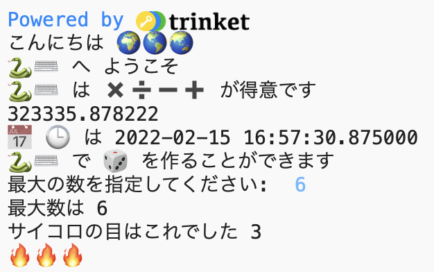

## サイコロを振る

Pythonで乱数を使ったデジタルサイコロを作ることができます。

{:width="300px"}

Pythonでは、アクションを実行するために**関数()**を**呼び出し**ます。 すでに`print()`関数を使用してテキストを出力しています。

新しい**関数**を**定義**してコードをグループ化し、名前を付けて再利用することができます。

--- task ---

関数は、呼び出す前に定義する必要があります。 **main.py**タブの上部にある`# 関数の定義をこの下に書く`のコメントを探します。

`random`ライブラリの`randint()`関数を使用して1から6までのランダムな「整数」を生成し、それを画面に出力する`roll_dice()`という新しい関数を定義します。

--- code ---
---
language: python 
filename: main.py 
line_numbers: true 
line_number_start: 7
line_highlights: 9-12
---

#関数の定義をこの下に書く

def roll_dice(): #この行の終わりにあるコロンを忘れないでください   
  print(python, 'で', dice, 'を作ることができます')   
  print('サイコロの目はこれでした', randint(1, 6))

--- /code ---

`def roll_dice():`の下の行は**インデント**されています。 これを行うには、キーボードの<kbd>Tab</kbd>文字を使用します（通常、キーボードの<kbd>CAPSLOCK</kbd>の上にあります）。 コードをインデントすることで、それらの行が関数の一部であることをPythonに示します。

**ヒント：**アンダースコア`_` は、Pythonの変数名や関数名を読みやすくするために単語の間に入れられます。 スペースは使用できません。

--- collapse ---
---
title: 英国または米国のキーボードで特殊文字を入力する
---

英国または米国のキーボードでは、コロン`:`は<kbd>L</kbd>キーの横のセミコロンと同じキーにあります。<kbd>Shift</kbd>を押しながら<kbd>;</kbd>をたたいて`:`を入力します。 アンダースコア`_`は<kbd>0</kbd>キーの横の`-`と同じキーにあります。<kbd>Shift</kbd>を押しながら<kbd>-</kbd>をたたいて`_`を入力します。

--- /collapse ---

--- /task ---

--- task ---

**テスト：**今、コードを「Run」してもサイコロは振られません。 これは、`roll_dice()`関数を定義しましたが、まだ呼び出していないからです。

--- /task ---

--- task ---

関数を使用するには、コードで関数を呼び出す必要があります。 コードの最後に移動し、新しい行を追加して`roll_dice()`関数を呼び出します。

--- code ---
---
language: python 
filename: main.py 
line_numbers: true 
line_number_start: 20
line_highlights: 22
---

print(calendar, clock, 'は', datetime.now())

roll_dice() # roll_dice関数を呼び出す

--- /code ---

--- /task ---

--- task ---

**テスト：**プロジェクトを数回実行して、毎回ランダムにサイコロが振られることを確認します。

**デバッグ：**関数名を作成するときに、rollとdiceの間にアンダースコア`_`があることを確認してください。 行の終わりにコロン `:`があることを確認してください。

**デバッグ：**`def roll_dice()` の下の行がインデントされていることを確認します。 Pythonでこれを間違えることは実によくあることなので、必ず確認してください。

--- /task ---

乱数は、暗号化やデータサイエンス、そしてゲームやコンピューターアートへ多様性を与えるのに使用されます。 コンピューターは、アルゴリズムを使用して**乱数**を生成します。 数値を本当にランダムにするには、現実の世界からの予測できない入力が必要です。

--- task ---

`fire`変数は、🔥の絵文字を格納しています。 `print(fire * 3)`というコードは、3つの火の絵文字 '🔥🔥🔥'を出力します。 サイコロの目と同じ数の絵文字を出力する必要があります。

--- collapse ---
---
title: '`print(fire * randint(1, 6))`とするとどうなるでしょう？'
---

通常、最初の乱数とは異なる新しい乱数が表示されます。

--- /collapse ---

うーん、どうすれば同じ乱数を使用できるようになるでしょうか？

コードを変更して、`randint()`が返す値を`roll`という変数に保存し、その変数を使用して、サイコロの目の数字と、それと同じだけの🔥の絵文字を出力します。

--- code ---
---
language: python 
filename: main.py 
line_numbers: true 
line_number_start: 7
line_highlights: 11 - 13
---

#関数の定義をこの下に書く

def roll_dice():    
  print(python, 'で', dice, 'を作ることができます')    
  roll = randint(1, 6) #1から6までの乱数を生成    
  print('サイコロの目はこれでした', roll) #roll変数の値を出力     
  print(fire * roll) #サイコロの目と同じだけ火の絵文字を繰り返す

--- /code ---

必要に応じて、`fire`の代わりに`star`または`heart`を使用できます。

`*`の記号は、掛けることを意味します。なので、`fire * roll`は、 `fire`変数に格納されているテキスト('🔥')を`roll`変数に保存されている数だけ増やします。

--- /task ---

--- task ---

**テスト：**プロジェクトを数回テストします。 コードがどのように機能するかを理解してください。

**ヒント：**変数は、コードで同じ値を複数回使用する必要がある場合に役立ちます。 変数にわかりやすい名前を付けるとコードが理解しやすくなります。

--- /task ---

ユーザーが最大数を選択できるようにサイコロをアップグレードします。

多くのゲームは多面的なサイコロを使用しています。 現実の世界では、サイコロは一般的な幾何学的形状から作られています。 一般的なサイコロには、D6、D12、およびD20が含まれます。 コンピューターでは、ランダムな数値を生成して、任意の数の面を持つ公正なサイコロを作ることができます。

--- task ---

`input()`関数は、ユーザーに質問をして、その答えを返します。

ユーザーにサイコロの最大数を尋ね、結果を`max`という名前の変数に保存します。そして選択した数を出力領域に`print`します。

--- code ---
---
language: python 
filename: main.py 
line_numbers: true 
line_number_start: 7
line_highlights: 11-12
---

#関数の定義をこの下に書く

def roll_dice():   
  print(python, 'で', dice, 'を作ることができます')   
  max = input('最大数を指定してください:') #ユーザーの入力を待つ    
  print('最大数は', max) #ユーザーが入力した数字を使用    
  roll = randint(1, 6)    
  print('サイコロの目はこれでした', roll)    
  print(fire * roll)

--- /code ---

--- /task ---

--- task ---

`roll`変数のコードを変更して、乱数を生成するときに`randint`が `max`を最大値として使用するようにします。

ユーザーから入力を受け取ると、Pythonはそれをテキストとして扱います。 でも、 `randint` には正の整数が必要です。 `int`関数は、ユーザー入力を整数に変換します。

--- code ---
---
language: python 
filename: main.py 
line_numbers: true 
line_number_start: 7
line_highlights: 13
---

#関数の定義をこの下に書く

def roll_dice():   
  print(python, 'で', dice, 'を作ることができます')   
  max = input('最大の数を指定してください:') #ユーザーの入力を待つ   
  print('最大数は', max) #ユーザーが入力した数字を使用   
  roll = randint(1, int(max)) #randintには 整数である maxが必要'   
  print('サイコロの目はこれでした', roll)   
  print(fire * roll)

--- /code ---

--- /task ---

--- task ---

**テスト：**プロジェクトを実行します。 プログラムが`input`行に達すると、あなたが返答を入力するのを待ってから続行します。 別の数値を`input`してもう一度やってみてください。

--- /task ---

--- save ---
