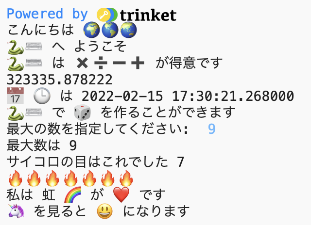

## 文のとっかかり

プロジェクトでもっとたくさんの文を出力します。

{:width="300px"} 

--- task ---

コードにもっと`print`行を追加します。 使用する文のとっかかりをいくつか示します。

--- code ---
---
language: python filename: main.py line_numbers: true line_number_start: 29
line_highlights: 30-32
---

print('私は', '...', heart)   
print('... を見ると', happy, 'な気持ちになります')   
print('私は', python, 'で... を作りたいと思います')

--- /code ---

**ヒント：**`print` は、表示する各アイテムの間にスペースを追加します。

**ヒント：**アポストロフィ`'` を表示する必要がある場合は、その前にバックスラッシュ`\`を付けて、Pythonがアポストロフィもテキストの一部であることを認識できるようにする必要があります。

**Tip:** Add a `#` at the beginning of a line to turn it into a comment.

--- /task ---

黄色のハートの絵文字 は、友情と幸福を示すためによく使用されます。

--- task ---

友達を元気づけるために、どんなメッセージを送りますか？ どの絵文字を選びますか？

Trinketの**emoji.py**タブをクリックして、使用できる絵文字変数を確認します。 Copy the ones you choose and save them to a variable or add them directly to your code.

**emoji.py**にさらに絵文字変数を追加できます。 この[絵文字リスト](https://unicode.org/emoji/charts/full-emoji-list.html){:target="_blank"}を使用して、欲しい絵文字を見つけてください。

📅🕒🎨🎮🔬🎉🕶️🎲🦄🚀💯⭐💛 😃😜❤️📚⚽🎾👟♻️🌳🔥✨🥺🌈

[[[choose-an-emoji]]]

--- /task ---

--- save ---
