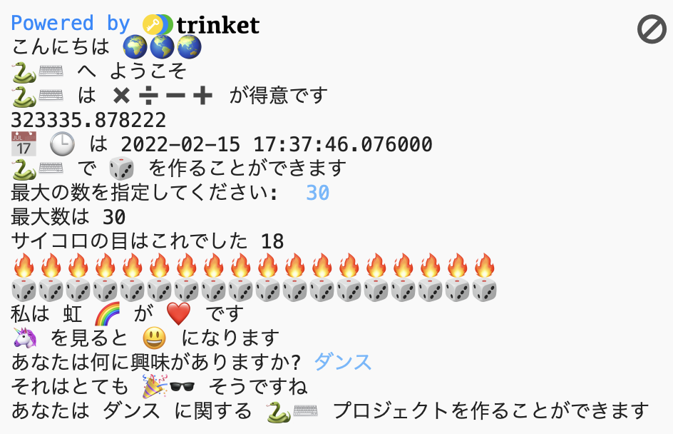

## プロジェクトをアップグレードする

プロジェクトにもっと追加しましょう。 選択できる絵文字は他にもあります。
  

{:width="300px"} 

こんなことができます。
+ 違うテキストや絵文字を使って`print`する
+ `input`を使用してユーザーから値を取得し、それを変数として格納してから、変数を使った計算を行う
+ もっと関数を書いてコードを整理する
+ `#`を使用して、コードにコメントを追加する

**emoji.py**クリックして、使用できる絵文字変数を確認します。 Copy the ones you choose and save them to a variable or add them directly to your code.

**Tip:** To add emojis, find the comment # Emojis to copy and paste into your code. Copy the emojis you want to use then paste them into your code.

📅🕒🎨🎮🔬🎉🕶️🎲🦄🚀💯⭐💛 😃😜❤️📚⚽🎾👟♻️🌳🔥✨🥺🌈

[[[choose-an-emoji]]]

趣味について尋ねる関数の例を次に示します。

--- code ---
---
language: python
filename: main.py
---

# 動かしたいコードをこの下に書く
def hobbies():   
hobby = input('あなたは何に興味がありますか?')   
print('それは', fun, 'そうですね')   
print(python, 'で', hobby, 'に関するプロジェクトを作ることができます')

--- /code ---

**ヒント：**関数を定義するだけでなく、呼び出す必要があることを忘れないでください。

`input`を使うと、プロジェクトの任意の時点で、ユーザーが <kbd>Enter</kbd>をたたくまで待たせることができます。

--- code ---
---
language: python
filename: main.py
---

roll_dice()

input() # ユーザーがEnterをたたくのを待つ

hobbies()

--- /code ---

--- collapse ---
---
title: 完成したプロジェクト
---

[完成したプロジェクトはこちら](https://trinket.io/embed/python/2dac038492){:target="_blank"}で確認できます。

--- /collapse ---

--- save ---
