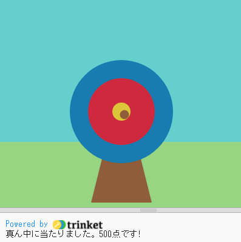

## 次は何をしますか？

[Python入門](https://projects.raspberrypi.org/ja-JP/raspberrypi/python-intro)パスに沿って進めている方は、[射的](https://projects.raspberrypi.org/ja-JP/projects/target-practice)プロジェクトに進みましょう。 このプロジェクトでは、的を描き、矢を放ってポイントを獲得するアーチェリーゲームを作成します。

--- print-only ---

--- /print-only ---

--- no-print ---

<iframe src="https://trinket.io/embed/python/f686c82d8a?outputOnly=true&start=result" width="600" height="500" frameborder="0" marginwidth="0" marginheight="0" allowfullscreen mark="crwd-mark">
</iframe>

--- /no-print ---

Pythonのさまざまな機能を触ってみたい場合は[これらのプロジェクト](https://projects.raspberrypi.org/ja-JP/projects?software%5B%5D=python)を試してみてください。

***
このプロジェクトは以下のボランティアによって翻訳されました。

大野 雅利
横川 裕隆]

ボランティアのおかげで、世界中の人々に母国語で学ぶ機会を与えることができます。翻訳を引き受けていただくことで、より多くの人々に手を差し伸べることができます。詳しくは [rpf.io/translate](https://rpf.io/translate) をご覧ください。
