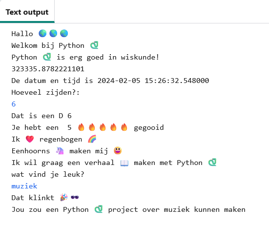

## Wat ga je maken

Ontdek wat de programmeertaal Python kan door een interactief project te schrijven dat emoji gebruikt.

**Emoji** zijn kleine kleurrijke afbeeldingen die worden gebruikt om extra betekenis aan berichten toe te voegen. Emoji betekent 'beeldwoord' in het Japans.

Je gaat:
+ Met `print()` tekst, inclusief emoji, tonen en `input()` van de gebruiker benutten
+ Tekst en getallen opslaan in **variabelen**
+ **Functies** gebruiken om je code te ordenen

--- no-print ---

--- task ---

### Probeer het uit

  
Lees de uitvoer en tik vervolgens op <kbd>Enter</kbd> om door te gaan. 
Typ jouw antwoorden op de vragen. Kun je zien hoe je antwoorden worden gebruikt?

  <iframe src="https://trinket.io/embed/python/e8b24c1279?outputOnly=true&start=result" width="600" height="500" frameborder="0" marginwidth="0" marginheight="0" allowfullscreen>
  </iframe>
  

--- /task ---

--- /no-print ---

--- print-only ---

--- /print-only ---
