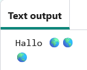
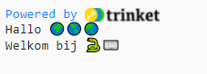

## Druk hallo af

In Python worden met `print()`{:.language-python} strings (woorden of getallen) op het scherm weergegeven.

--- task ---

Open het [Hallo 🌍🌎🌏 startproject](https://editor.raspberrypi.org/en/projects/hello-world-starter){:target="_blank"}. De code-editor wordt geopend in een ander browsertabblad.

--- /task ---

--- task ---

Zoek de regel `# Plaats de code die moet worden uitgevoerd hieronder`{:.language-python}.

Klik onder die regel. De knipperende `|` is de cursor en geeft aan waar je gaat typen.

--- /task ---

--- task ---

Typ de code in zodat Hallo wordt ge`print()`{:.language-python} op het scherm:

--- code ---
---
language: python line_numbers: true line_number_start: 20
line_highlights: 21
---
# Put code to run under here.
print(f'Hello')

--- /code ---

--- /task ---

--- task ---

**Test:** Klik op de knop **Run** om je code uit te voeren.

Je zou `Hallo` in het tekstuitvoergebied moeten zien.

--- /task ---

Een **variabele** wordt gebruikt om waarden zoals tekst of getallen op te slaan. We hebben enkele variabelen opgenomen die emoji-tekens opslaan.

--- task ---

Wijzig je code zodat ook er een `print()`{:.language-python} wordt gedaan van de inhoud van de `wereld`{:.language-python} variabele. Je kan dit doen door de variabelenaam tussen accolades `{}`{:.language-python} toe te voegen

--- code ---
---
language: python line_numbers: true
line_number_start: 20
---
# Put code to run under here
print(f'Hello {world}')

--- /code ---

Met het teken `f`{:.language-python} in het print commando kun je eenvoudig variabelen samen met tekstreeksen afdrukken.

--- /task ---

--- task ---

**Test:** Voer je code uit om het resultaat te zien:

--- /task ---

--- task ---

**Voeg** nog een regel toe aan je code om meer tekst en emoji's te printen via het commando `print()`{:.language-python}:

--- code ---
---
language: python line_numbers: true line_number_start: 20
line_highlights: 22
---
# Put code to run under here
print(f'Hello {world}') print(f'Welcome to {python}')

--- /code ---

--- /task ---

--- task ---

**Testen:** Klik op **Run**.

**Tip:** Het is een goed idee om je code na elke wijziging uit te voeren, zodat je problemen snel kunt oplossen.

--- /task ---

