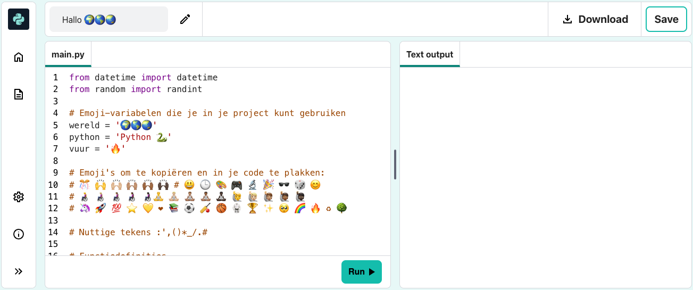
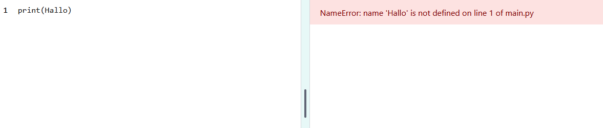
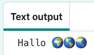

## Zeg hallo

<div style="display: flex; flex-wrap: wrap">
<div style="flex-basis: 200px; flex-grow: 1; margin-right: 15px;">
Het is traditie om een programma te schrijven om 'Hallo wereld!' uit te voeren. wanneer je een nieuwe programmeertaal leert.
</div>
<div>

{:width="200px"}

</div>
</div>

--- task ---

Open het [Hallo 🌍🌎🌏 startproject](https://editor.raspberrypi.org/en/projects/hello-world-starter){:target="_blank"}. De code-editor wordt geopend in een ander browsertabblad.



Als je een Raspberry Pi-account hebt, kun je op de **Save** knop klikken om een kopie op te slaan in je **Projects**.

--- /task ---

--- collapse ---

---
title: Werk je op een Raspberry Pi?
---

Als je met Chromium op een Raspberry Pi werkt, zie je de emoji's misschien niet. Je moet een lettertype installeren dat ze ondersteunt.

Open een terminal en typ dan:

```bash
sudo apt install fonts-noto-color-emoji
```

Start Chromium opnieuw op en nu zou je de kleurenemoji's moeten kunnen zien.

--- /collapse ---

### Druk hallo af

<p style="border-left: solid; border-width:10px; border-color: #0faeb0; background-color: aliceblue; padding: 10px;">
Regels die beginnen met een `#` zijn <span style="color: #0faeb0">**opmerkingen**</span>. Ze leggen uit wat de code doet. Opmerkingen worden genegeerd door Python.
</p>

De `import`-regels vertellen Python dat je code gaat gebruiken die je niet zelf hebt geschreven.

In Python voert `print()` tekst (woorden of getallen) uit naar het scherm.

--- task ---

Zoek de `# Zet de code om uit te voeren hieronder` regel.

Klik onder die regel. De knipperende `|` is de cursor en geeft aan waar je gaat typen.

--- /task ---

--- task ---

Typ de code om Hallo op het scherm te `print()`-en:

**Tip:** Wanneer je een haakje openen `(` of een aanhalingsteken openen `'` typt, zal de code-editor automatisch een haakje sluiten `)` of aanhalingsteken sluiten`'` toevoegen:

--- code ---
---
language: python filename: main.py line_numbers: true line_number_start: 17
line_highlights: 18
---

# Zet de code om uit te voeren hier onder
print('Hallo')

--- /code ---

--- collapse ---
---
title: Speciale tekens typen op een Brits of Amerikaans toetsenbord
---

Op een Brits of Amerikaans toetsenbord staan de linker `(` en rechter `)` ronde haakjes op de toetsen <kbd>9</kbd> en <kbd>0</kbd>. Om een linker rond haakje te typen, houdt je de <kbd>Shift</kbd>-toets ingedrukt (naast <kbd>Z</kbd>) en tikt vervolgens op <kbd>9</kbd>. Het enkele aanhalingsteken `'` staat in dezelfde rij als de <kbd>L</kbd> toets, net voor de <kbd>Enter</kbd> toets. De komma `,` staat naast de <kbd>M</kbd>.

--- /collapse ---

--- /task ---

--- task ---

**Test:** Klik op de knop **Run** om je code uit te voeren. In de code-editor verschijnt de uitvoer aan de rechterkant:


**Debuggen:** Als je een foutmelding krijgt, controleer dan je code heel goed. In dit voorbeeld ontbreken de enkele aanhalingstekens rond `Hallo` zodat Python niet weet dat het tekst moet zijn.



--- /task ---

## Print 🌍🌎🌏

In Python wordt een **-variabele** gebruikt om tekst of getallen op te slaan. Variabelen maken het voor mensen gemakkelijker om code te lezen. Je kunt dezelfde variabele op veel plaatsen in je code gebruiken. Als je een logische naam kiest voor een variabele, dan kun je later gemakkelijker onthouden waarvoor deze dient.

We hebben enkele variabelen opgenomen die emoji-tekens opslaan.

--- task ---

Blader in je code-editor naar de regels met de emoji's opgeslagen in twee verschillende variabelen. Zoek de variabele `wereld`, die de tekst '🌍🌍🌍' opslaat.

--- /task ---

--- task ---

Je kunt met `print()` meer dan één item tegelijk laten zien door een komma `,` tussen de items op te nemen. `print()` voegt een spatie toe tussen elk item.

Verander je `print()` code om ook de inhoud van de `wereld` variabele te tonen:

--- code ---
---
language: python filename: main.py line_numbers: true line_number_start: 17
line_highlights: 18
---

# Zet de code om uit te voeren hier onder
print('Hallo', wereld)

--- /code ---

**Tip:** `'Hallo'` is een tekenreeks omdat er enkele aanhalingstekens omheen staan, terwijl `wereld` een variabele is, zodat de erin opgeslagen waarde wordt getoond.

--- /task ---

--- task ---

**Test:** Voer je code uit om het resultaat te zien:



**Tip:** Emoji's kunnen er op verschillende computers anders uitzien, dus de jouwe zien er misschien niet precies hetzelfde uit.

**Debuggen:** Zorg ervoor dat je een komma hebt toegevoegd tussen de items `print()` en dat je `wereld` correct hebt gespeld.

In dit voorbeeld ontbreekt de komma `,`. Het is klein maar heel belangrijk!


--- /task ---

--- task ---

Voeg nog een regel toe aan je `print()` code om meer tekst en emoji te maken:

--- code ---
---
language: python filename: main.py line_numbers: true line_number_start: 18
line_highlights: 19
---

print('Hallo', wereld)    
print('Welkom bij', python)

--- /code ---

**Tip:** De code die je moet typen, is in een lichtere kleur gemarkeerd. Code die niet gemarkeerd is, helpt je te ontdekken waar je de nieuwe code moet toevoegen.

--- /task ---

--- task ---

**Testen:** Klik op **Run**.


**Tip:** Het is een goed idee om je code na elke wijziging uit te voeren, zodat je problemen snel kunt oplossen.

**Debuggen:** Controleer zorgvuldig op haakjes, aanhalingstekens, komma's en correcte spelling. In Python moet je echt nauwkeurig zijn.

--- /task ---

Als je een Raspberry Pi-account hebt, kun je in je code-editor op de knop **Save** klikken om een kopie van je project in jouw projecten op te slaan.

--- save ---
