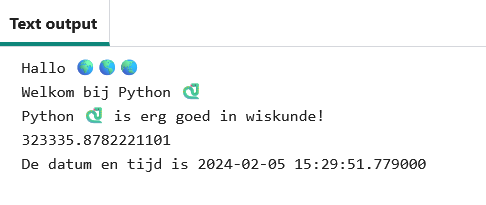

## Sommen en datums

Python is geweldig in het werken met getallen en datums.

{:width="300px"} 

In Python kun je wiskundige operatoren gebruiken om sommen te maken:

| + | optellen |   
| - | aftrekken |   
| * | vermenigvuldigen |   
| / | delen |   
| ** | machtsverheffen |

### Maak een berekening

--- task ---

Voeg nog twee `print()` regels toe aan je code, met daarin een som voor Python om uit te werken:

**Tip:**Om een `*` symbool te krijgen, druk tegelijk op <kbd>Shift</kbd> en <kbd>8</kbd>.

--- code ---
---
language: python
filename: main.py
line_numbers: true
line_number_start: 18
line_highlights: 20-21
---

print('Hallo', wereld)   
print('Welkom bij', python)   
print(python, 'is erg goed in wiskunde!')   
print(230 * 5782 ** 2 / 23781) # Print het resultaat van de som

--- /code ---

**Tip:** Je hoeft de opmerkingen niet te typen, ze zijn er alleen om je te helpen de code te begrijpen. Typ gewoon het gedeelte voor de `#`.

--- /task ---

--- task ---

**Test:** Voer je code uit om het resultaat te zien. Heeft Python de som correct berekend? Grapje! Python doet de moeilijke wiskunde voor je, dus je hoeft het niet uit te werken.

**Fouten oplossen:**

--- collapse ---
---
title: Ik heb een syntax fout
---

Zorg ervoor dat je een komma `,` hebt toegevoegd tussen de items in `print()` en dat je `python` correct hebt gespeld.

--- /collapse ---

--- /task ---

De Japanse computerwetenschapper **Emma Haruka Iwao** gebruikte een computer om de waarde van Pi (*π*) tot 31 biljoen cijfers te berekenen. Dat antwoord is zo lang dat het meer dan 300.000 jaar zou duren om het te zeggen! 

--- task ---

Probeer de som die Python doet te veranderen in een ingewikkelde som!

Je kunt ook haakjes gebruiken als je de volgorde wilt bepalen waarin Python de som berekent: `print( (2 + 4) * (5 + 3) )`.

--- /task ---

--- task ---

**Test:** Voer je code uit en laat Python je som berekenen.

**Debuggen:**Zorg ervoor dat om je som er een linker en rechter rond haakje staat `(2 * 45)`. Als je extra haakjes gebruikt om de volgorde te controleren, zorg dan dat je een rechter haakje laat passen bij het linker haakje.

--- /task ---

--- task ---

In de code-editor is de tekst misschien te groot of te klein om te lezen. Je kunt deze instellingen eenvoudig aanpassen aan jouw voorkeur.

**Tip:** Klik op het **Instellingenmenu**  aan de linkerkant van je code-editor. Klik vervolgens op een van de knoppen **Text Size** (tekstgrootte) om de grootte van de tekst te wijzigen.

Je kunt ook schakelen tussen kleureninstellingen, klik op de **Light & Dark** knoppen om de wijzigingen te zien.

--- /task ---

De regel `from datetime import *` bovenaan het tabblad **main.py** bevat een bibliotheek met handige functies voor het verkrijgen van de huidige datum en tijd.

Een van de geweldige dingen van Python zijn alle **bibliotheken** met code die beschikbaar is voor gebruik. Met een Python-bibliotheek kun je eenvoudig code gebruiken die andere mensen hebben geschreven. Er zijn bibliotheken voor het tekenen van grafieken en diagrammen, het maken van kunst, het doen van berekeningen en nog veel meer.

--- task ---

Voeg nog een regel toe aan je code om de huidige datum en tijd te `print`-en.

Haal de huidige datum en tijd op door de functie `now()` uit de `datetime` -bibliotheek te gebruiken:

--- code ---
---
language: python
filename: main.py
line_numbers: true
line_number_start: 20
line_highlights: 22
---

print(python, 'is erg goed in wiskunde!')    
print(230 * 5782 ** 2 / 23781) # Print het resultaat van de som     
print('De datum en tijd is', datetime.now()) # Druk de huidige datum en tijd af

--- /code ---

**Tip:** Je hoeft de opmerkingen niet te typen, ze zijn er alleen om je te helpen de code te begrijpen. Typ gewoon het gedeelte voor de `#`.

--- /task ---

--- task ---

**Test:** Voer je code een paar keer uit om de nieuwe datum- en tijduitvoer te zien.

**Debuggen:** Controleer of je een punt hebt `.` tussen `datetime` en `now`. Controleer alle interpunctie zorgvuldig.

--- /task ---

--- save ---
