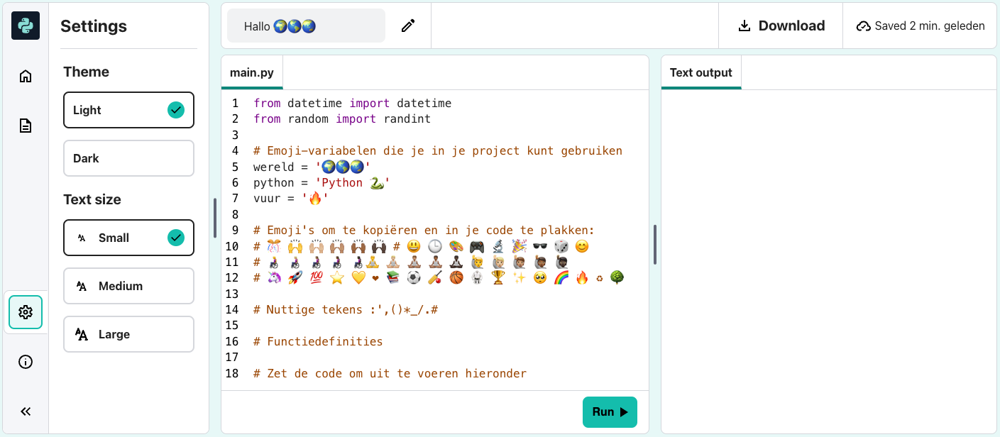

## Sommen en datums

Python is geweldig in het werken met getallen en datums.

{:width="300px"} 

In Python kun je wiskundige operatoren gebruiken om sommen te maken:

| + | optellen |   
| - | aftrekken |   
| * | vermenigvuldigen |   
| / | delen |   
| ** | machtsverheffen |

### Create a calculation

--- task ---

Voeg nog twee `print()` regels toe aan je code, met daarin een som voor Python om uit te werken:

**Tip:** To get a `*` symbol press <kbd>Shift</kbd> and <kbd>8</kbd> at the same time.

--- code ---
---
language: python filename: main.py line_numbers: true line_number_start: 14
line_highlights: 14-15
---

print('Hallo', wereld)   
print('Welkom bij', python)   
print(python, 'is erg goed in', sommen)   
print(230 * 5782 ** 2 / 23781)

--- /code ---

**Tip:** Je hoeft de opmerkingen niet te typen, ze zijn er alleen om je te helpen de code te begrijpen. Typ gewoon het gedeelte voor de `#`.

--- /task ---

--- task ---

**Test:** Voer je code uit om het resultaat te zien. Heeft Python de som correct berekend? Grapje! Python doet de moeilijke wiskunde voor je, dus je hoeft het niet uit te werken.

**Debug:**

--- collapse ---
---
title: I have a syntax error
---

Make sure that you have added a comma `,` between the items in `print()` and that you have spelled `python` correctly.

--- /collapse ---

--- /task ---

De Japanse computerwetenschapper **Emma Haruka Iwao** gebruikte een computer om de waarde van Pi (*π*) tot 31 biljoen cijfers te berekenen. Dat antwoord is zo lang dat het meer dan 300.000 jaar zou duren om het te zeggen! 

--- task ---

Try changing the sum that Python does to a complicated one!

Je kunt ook haakjes gebruiken als je de volgorde wilt bepalen waarin Python de som berekent: `print( (2 + 4) * (5 + 3) )`.

--- /task ---

--- task ---

**Test:** Voer je code uit en laat Python je som berekenen.

**Debuggen:**Zorg ervoor dat om je som er een linker en rechter rond haakje staat `(2* 45)`. Als je extra haakjes gebruikt om de volgorde te controleren, zorg dan dat je een rechter haakje laat passen bij het linker haakje.

--- /task ---

--- task ---

On the code editor, you might find the text too big or too small to read. You can easily change these settings to suit your preference.

**Tip:** Klik op het **hamburger menu** (het pictogram met drie lijnen) linksboven in je Trinket-editor. Klik vervolgens op de knop **Fullscreen** om je project op volledig scherm te bekijken.

You can also switch between colour modes, click on the **Light & Dark** buttons to see the changes.

--- /task ---

De regel `from datetime import *` bovenaan het tabblad **main.py** bevat een bibliotheek met handige functies voor het verkrijgen van de huidige datum en tijd.

Een van de geweldige dingen van Python zijn alle **bibliotheken** met code die beschikbaar is voor gebruik. Met een Python-bibliotheek kun je eenvoudig code gebruiken die andere mensen hebben geschreven. Er zijn bibliotheken voor het tekenen van grafieken en diagrammen, het maken van kunst, het doen van berekeningen en nog veel meer.

--- task ---

Voeg nog een `print`regel toe aan je code om wat meer tekst en de emoji-variabelen `kalender` en `klok` te tonen.

Haal de huidige datum en tijd op door de functie `now()` uit de `datetime` -bibliotheek te gebruiken:

--- code ---
---
language: python filename: main.py line_numbers: true line_number_start: 12
line_highlights: 16-17
---

print(python, 'is erg goed in', sommen)    
print(230 * 5782 ** 2 / 23781) #Print het resultaat van de som     
print('De', kalendar, klok, 'is', datetime.now()) #Print met emoji

--- /code ---

**Tip:** You don't need to type the comments, they are just there to help you understand the code. Just type the part before the `#`.

--- /task ---

--- task ---

**Test:** Voer je code een paar keer uit om de nieuwe datum- en tijduitvoer te zien.

**Debuggen:** Controleer of je een punt hebt `.` tussen `datetime` en `now`. Controleer alle interpunctie zorgvuldig.

--- /task ---

--- save ---
