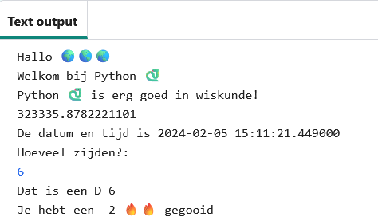
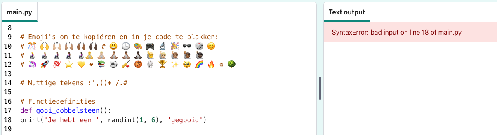

## Gooi een dobbelsteen 🎲

Maak een functie voor het gooien van een dobbelsteen met behulp van willekeurige getallen. 
  
In Python: 
- **functies**, gedefinieerd door `def`, zijn hetzelfde als 'mijn blokken' in Scratch,
- `randint` is hetzelfde als 'willekeurig' in Scratch, en
- `input` is hetzelfde als 'vraag' in Scratch.

{:width="300px"} 

In Python **roep** je een **functie()** aan om een actie uit te voeren. Je hebt de functie `print()` al gebruikt om tekst uit te voeren.

Je kunt een nieuwe **functie** **definiëren** om code te groeperen, zodat je deze een naam kunt geven en opnieuw kunt gebruiken.

### Definieer je functie

--- task ---

Functies moeten gedefinieerd worden voordat je ze kunt aanroepen. Zoek naar de opmerking bovenaan het tabblad **main.py** met de tekst `#Functiedefinities`.

Definieer een nieuwe functie genaamd `gooi_dobbelsteen()` die de functie `randint()` gebruikt, uit de `random` bibliotheek, om een willekeurig 'integer' (geheel getal) van 1 tot 6 te genereren en op het scherm uit te tonen.

--- code ---
---
language: python
filename: main.py
line_numbers: true
line_number_start: 15
line_highlights: 16-17
---

# Functiedefinities
def gooi_dobbelsteen(): # Vergeet de dubbele punt aan het einde van deze regel niet   
    print('Je hebt een ', randint(1, 6), 'gegooid') # randint(1, 6) wordt gebruikt om een getal tussen 1 en 6 te geven.

--- /code ---

De regels onder `def gooi_dubbelsteen():` zijn **ingesprongen**. Gebruik hiervoor de <kbd>Tab</kbd>-toets op je toetsenbord (meestal boven <kbd>CAPSLOCK</kbd> op het toetsenbord). Inspringende code vertelt Python dat de ingesprongen regels deel uitmaken van de functie.

**Tip:** Het lage streepje `_` wordt gebruikt om woorden in variabele- en functienamen in Python tussen woorden te plaatsen om ze leesbaarder te maken. Je kunt geen spatie gebruiken.

--- collapse ---
---
title: Speciale tekens typen op een toetsenbord
---

Op een toetsenbord staat de dubbele punt `:` op dezelfde toets als de puntkomma, naast de <kbd>L</kbd> toets: houd <kbd>Shift</kbd> ingedrukt en tik op <kbd>;</kbd> om een `:` te typen. Het lage streepje `_` staat op dezelfde toets als de `-`, naast de <kbd>0</kbd>, houd <kbd>Shift</kbd> ingedrukt en tik op <kbd>-</kbd> om een `_` te typen.

--- /collapse ---

--- /task ---

--- task ---

**Test:** Als je jouw code nu 'uitvoert' door op Run te klikken, wordt er geen dobbelsteen gegooid. Dat komt omdat je de functie `gooi_dobbelsteen()` wel hebt gedefinieerd, maar nog niet hebt aangeroepen.

**Fouten oplossen:**

--- collapse ---
---
title: Ik heb een syntaxfout
---

- Zorg ervoor dat er een onderstrepingsteken `_` tussen gooi en dobbelsteen staat om de functienaam te maken.

- Zorg ervoor dat je een dubbele punt `:` aan het einde van de regel hebt staan.

- Controleer of de regel onder `def gooi_dobbelsteen()` is ingesprongen. Het wordt vaak verkeerd gedaan in Python, dus zorg ervoor dat je het controleert.

--- /collapse ---

--- /task ---

### Roep je functie aan

--- task ---

Om een functie te gebruiken, moet je deze in de code aanroepen. Ga naar het einde van je code en voeg een nieuwe regel toe om de functie `gooi_dobbelsteen()` aan te roepen:

--- code ---
---
language: python
filename: main.py
line_numbers: true
line_number_start: 25
line_highlights: 27
--- 

print('De datum en tijd zijn', datetime.now())

gooi_dobbelsteen() # Roep de dobbelsteen functie aan

--- /code ---

--- /task ---

--- task ---

**Test:** Voer je project meerdere keren uit om elke keer de willekeurige dobbelsteen te zien rollen.

--- /task ---

Het gebruik van willekeurige getallen omvat cryptografie, datawetenschap en het toevoegen van variatie in games en computerkunst. Computers genereren **willekeurige getallen** met behulp van een algoritme. Voor getallen die echt willekeurig zijn, heb je een onvoorspelbare invoer vanuit de echte wereld nodig.

### Gebruik 🔥🔥🔥 voor het gegooide getal

--- task ---

Je functie kan de 🔥 emoji-variabele gebruiken. De code `print(vuur * 3)` geeft drie vuur-emoji '🔥🔥🔥' weer. Je wilt het aantal emoji's tonen dat gelijk is aan het door de dobbelsteen gegooide getal.

Wijzig je code om de waarde die wordt geretourneerd door `randint()` op te slaan in een variabele met de naam `worp`. Gebruik die variabele om het getal te laten zien dat is gegooid met het overeenkomende aantal 🔥 emoji's.

--- code ---
---
language: python
filename: main.py
line_numbers: true
line_number_start: 15
line_highlights: 17-18
---

# Functiedefinities
def gooi_dobbelsteen(): 
    worp = randint(1, 6) # Genereer een willekeurig getal tussen 1 en 6 en sla dit op in de variabele 'worp'
    print('Je hebt een ', worp, vuur * worp, 'gegooid') # Herhaal de vuur-emoji zodat deze overeenkomt met de willekeurige dobbelsteenworp

--- /code ---

**Tip** Je kunt `ster` of `hart` gebruiken in plaats van `vuur` als je wilt, door je eigen emoji-variabelen te maken.

--- /task ---

--- task ---

**Test:** Test je project een paar keer. Zorg ervoor dat je begrijpt hoe de code werkt.

--- /task ---

### Kies het aantal zijden van de dobbelsteen

Verbeter je dobbelsteen zodat de gebruiker het maximale getal kan kiezen.

Veel spellen gebruiken veel-kantige dobbelstenen. In de fysieke wereld worden dobbelstenen gemaakt van regelmatige geometrische vormen. Veel voorkomende dobbelstenen zijn D6, D12 en D20. Op een computer kun je een willekeurig getal genereren om een eerlijke dobbelsteen te maken met een willekeurig aantal kanten.

--- task ---

De functie `input()` stelt de gebruiker een vraag en geeft vervolgens het antwoord terug.

**Voeg** code toe om de gebruiker om het grootste getal op zijn dobbelsteen te vragen en sla het resultaat vervolgens op in een variabele met de naam `max` en `print` het gekozen getal in het uitvoergebied:

Verander je `worp` variabele code om `max` te gebruiken als de maximale waarde voor `randint` wanneer het een willekeurig getal genereert.

Wanneer je invoer van een gebruiker krijgt, behandelt Python deze als tekst. Maar `randint` heeft een 'integer' nodig (een positief geheel getal). De functie `int` verandert de gebruikersinvoer in een geheel getal.

--- code ---
---
language: python
filename: main.py
line_numbers: true
line_number_start: 15
line_highlights: 18-20
---

# Functiedefinities

def gooi_dobbelsteen():   
    max = input('Hoeveel kanten?:') # Wacht op invoer van de gebruiker    
    print('Dat is een D', max) #Gebruik het getal dat de gebruiker heeft ingevoerd    
    worp = randint(1, int(max)) # voor randint  moet max een integer zijn print('Je hebt een ', worp, 'gegooid')

--- /code ---

Om een aanhalingsteken `'` af te drukken in een woord als `Zo'n`, plaats je een backslash `\` ervoor zodat Python weet dat het deel uitmaakt van de tekst.

--- /task ---

--- task ---

**Test:** Voer je project uit. Wanneer het programma de regel `input` bereikt, wacht het totdat je een antwoord invoert voordat het verder gaat. Typ je antwoord en druk vervolgens op <kbd>Enter</kbd>, hierdoor kan het programma je antwoord opslaan. Probeer het opnieuw met een ander `input` getal.

--- /task ---

--- save ---
