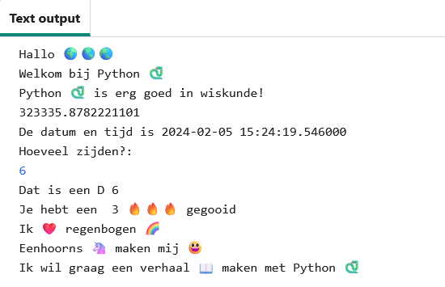

## Zin starter

Voer meer zinnen uit je project uit.

{:width="300px"}

--- task ---

Voeg meer `print` regels toe aan je code. Hier zijn enkele startzinnen die je kunt gebruiken:

--- code ---
---
language: python
filename: main.py
---

print('Ik', hart, '...')   
print('... maakt me', gelukkig)   
print('Ik wil graag ... maken met', python)

--- /code ---

**Tip:** `print` voegt een spatie toe tussen elk item dat je print.

**Tip:** Als je een apostrof `'` moet afdrukken, moet je er een backslash `\` voor plaatsen, zodat Python weet dat het deel uitmaakt van de tekst.

--- /task ---

De gele hart emoji wordt vaak gebruikt om vriendschap en geluk te tonen.

--- task ---

Welk bericht zou je naar een vriend sturen om hem op te vrolijken? Welke emoji zou jij kiezen?

Klik op het tabblad **emoji.py** in Trinket om de emoji-variabelen te zien die je kunt gebruiken. Klik op het tabblad **main.py** om code toe te voegen.

Je kunt meer emoji-variabelen toevoegen aan **emoji.py**. Gebruik deze [emoji-lijst](https://unicode.org/emoji/charts/full-emoji-list.html){:target="_blank"} om degene te vinden die je zoekt.

--- /task ---

--- save ---
