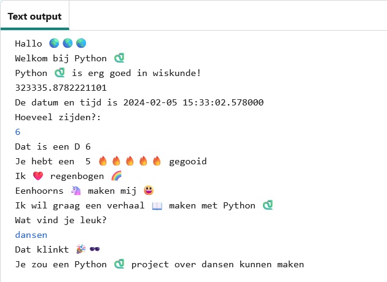

## Verbeter je project

Voeg meer toe aan je project. Er zijn meer emoji om uit te kiezen.
  

{:width="300px"}

Je kunt:
+ `print` gebruiken met verschillende tekst en emoji
+ `input` gebruiken om info van de gebruiker te krijgen en deze op te slaan als variabelen, en vervolgens sommen te maken met de variabelen
+ meer functies gebruiken om je code te ordenen
+ `#` gebruiken om opmerkingen aan je code toe te voegen

Klik op **emoji.py** om de emoji-variabelen te zien die je kunt gebruiken. Klik terug op **main.py** om code toe te voegen.

Hier is een voorbeeld functie die naar hobby's vraagt:

--- code ---
---
language: python
filename: main.py
---

#Zet de code om uit te voeren hier onder
def hobbys():    
  hobby = input('Wat vind je leuk?')   
  print('Dat klinkt', leuk)   
  print('Je zou een', python, 'project over jouw', hobby, 'kunnen maken')

--- /code ---

**Tip:** Vergeet niet dat je de functie zowel moet aanroepen als definiëren.

Je kunt `input` gebruiken om je project te laten wachten tot de gebruiker op <kbd>Enter</kbd> drukt op ieder punt in dit project.

--- code ---
---
language: python
filename: main.py
---

gooi_dobbelsteen()

input() #Wacht tot de gebruiker op Enter drukt

hobbys()

--- /code ---

--- collapse ---
---
title: Voltooid project
---

Je kunt het [voltooide project hier](https://trinket.io/embed/python/e8b24c1279){:target="_blank"} bekijken.

--- /collapse ---

--- save ---
