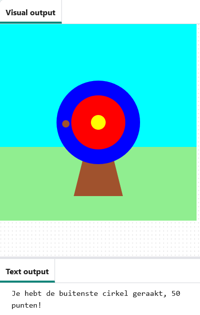

## Wat kun je verder nog doen?

Als je het [Inleiding tot Python](https://projects.raspberrypi.org/nl-NL/raspberrypi/python-intro) pad volgt, kun je doorgaan naar het [Boogschieten](https://projects.raspberrypi.org/nl-NL/projects/target-practice) project. In dit project teken je een doelwit en maak je vervolgens een boogschietspel dat pijlen schiet om punten te scoren.

--- print-only ---

{:width="640px"}

--- /print-only ---

--- no-print ---

Klik op de knop **Run** om een voorbeeld van dit project te bekijken.

<iframe src="https://editor.raspberrypi.org/nl-NL/embed/viewer/target-practice-solution" width="600" height="600" frameborder="0" marginwidth="0" marginheight="0" allowfullscreen>
</iframe>

--- /no-print ---

Als je meer plezier wilt hebben bij het verkennen van Python, dan kun je een van [deze projecten](https://projects.raspberrypi.org/nl-NL/projects?software%5B%5D=python) uitproberen.

***
Dit project werd vertaald door vrijwilligers:

Max Schaaper
Robert-Jan Kempenaar
Iny van Beuningen
Jeroen Wernsen

Dankzij vrijwilligers kunnen we mensen over de hele wereld de kans geven om in hun eigen taal te leren. Jij kunt ons helpen meer mensen te bereiken door vrijwillig te starten met vertalen - meer informatie op [rpf.io/translate](https://rpf.io/translate).
