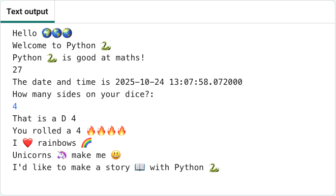

## To co zrobisz

Napisz interaktywny program używający emoji 🙌 🙌🏼 🙌🏽 🙌🏾 🙌🏿.

--- print-only ---

{:width="640px"}

--- /print-only ---

--- no-print ---

  

Kliknij przycisk **Run**

<iframe src="https://editor.raspberrypi.org/en/embed/viewer/hello-world-solution" width="600" height="600" frameborder="0" marginwidth="0" marginheight="0" allowfullscreen>
</iframe>

--- /no-print ---

