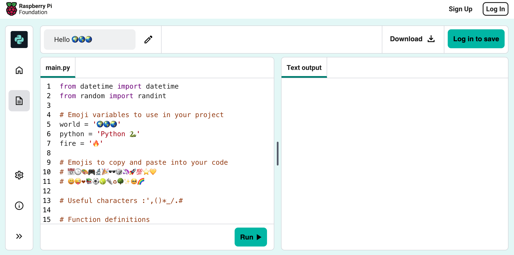
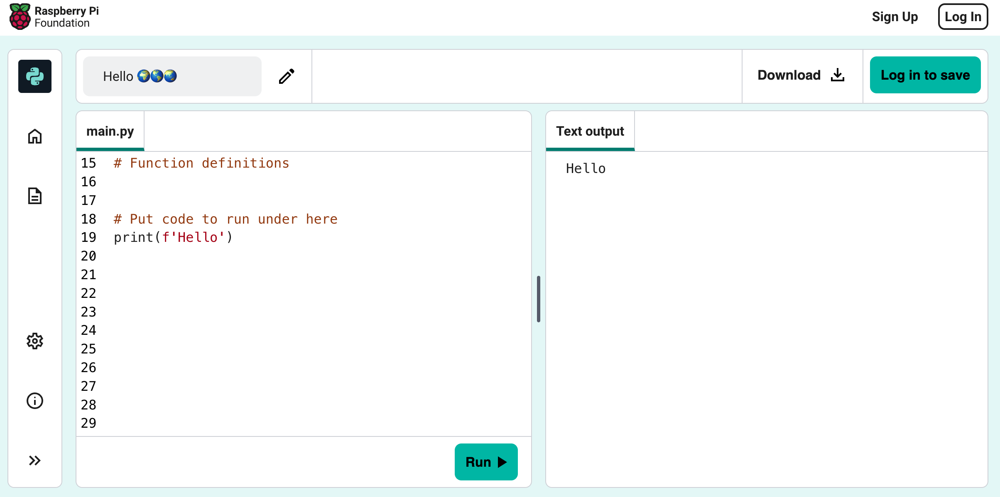
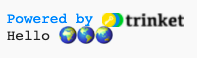

## Print hello

In Python, `print()`{:.language-python} outputs strings (words or numbers) to the screen.

--- task ---

Otwórz [Hello 🌍🌎🌏 projekt startowy](https://editor.raspberrypi.org/en/projects/hello-world-starter){:target="_blank"}. Edytor kodu otworzy się w innej karcie przeglądarki.

--- /task ---

--- task ---

Find the `# Put code to run below here`{:.language-python} line.

Kliknij poniżej tej lini. Migający znak `|` to kursor wskazujący, gdzie będziesz pisać.

--- /task ---

--- task ---

Wpisz kod aby wyświetlić `print()`{:.language-python} Hello na ekranie:

--- code ---
---
language: python line_numbers: true line_number_start: 17
line_highlights: 18
---
# Put code to run under here.
print(f'Hello')

--- /code ---

--- /task ---

--- task ---

**Test** Kliknij przycisk **Run**, aby uruchomić swój kod. To powinno się wyświetlić po uruchomieniu Twojego kodu:

--- /task ---

Zmienna **variable** używana jest aby przechowywać wartości takie jak tekst lub liczby. Dodaliśmy kilka zmiennych, które przechowują znaki emoji.

--- task ---

Change your code to also `print()`{:.language-python} the contents of the `world`{:.language-python} variable. Możesz to zrobić umieszczając nazwę zmiennej pomiędzy okrągłymi nawiasami `{}`{:.language-python}

--- code ---
---
language: python line_numbers: true
line_number_start: 17
---
# Umieść tutaj kod do uruchomienia
print(f'Hello {world}')

--- /code ---

Litera `f`{:.language-python} w funkcji print pozwala łatwo wyświetlać zmienne wraz z ciągami znaków.

--- /task ---

--- task ---

** Test:** Uruchom swój kod, aby zobaczyć wynik:

--- /task ---

--- task ---

**Dodaj** kolejną linię do swojego kodu aby `print()`{:.language-python} więcej tekstu i emoji:

--- code ---
---
language: python line_numbers: true line_number_start: 17
line_highlights: 19
---
# Put code to run under here
print(f'Hello {world}') print(f'Welcome to {python}')

--- /code ---

--- /task ---

--- task ---

**Test:** Kliknij **Run **.

** Wskazówka:** dobrze jest uruchomić kod po każdej zmianie, aby szybko rozwiązać problemy.

--- /task ---

