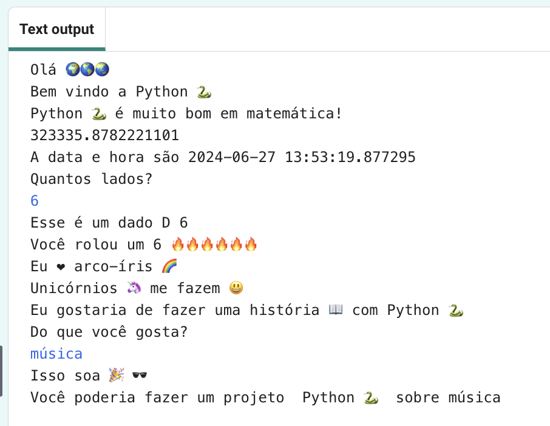

  <a class="c-survey-banner__link" href="https://form.raspberrypi.org/f/code-editor-feedback" target="_blank">Responda à nossa pesquisa</a> para ajudar a melhorar nosso Editor de código!

## Você vai fazer

Find out what the Python 🐍 programming language can do by writing an interactive project that uses emojis 🙌 🙌🏼 🙌🏽 🙌🏾 🙌🏿.

**Emoji** são pequenas imagens coloridas usadas para adicionar um significado extra às mensagens. Emoji significa "palavra imagem" em japonês.

Você deve:

+ `print()` text, including emojis 🚀, and get `input()` ⌨️ from the user
+ Armazenar texto e números em **variáveis**
+ Usar **funções** para organizar o seu código

--- no-print ---

### Jogue ▶️

--- task ---

  

Click on the **Run** button and read the output.

  When you are asked, type in a number and tap <kbd>Enter</kbd>. 

Can you see how your answers are used?

<iframe src="https://editor.raspberrypi.org/en/embed/viewer/hello-world-solution" width="600" height="600" frameborder="0" marginwidth="0" marginheight="0" allowfullscreen>
</iframe>

--- /task ---

--- /no-print ---

--- print-only ---

{:width="640px"}

--- /print-only ---