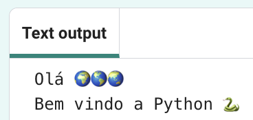
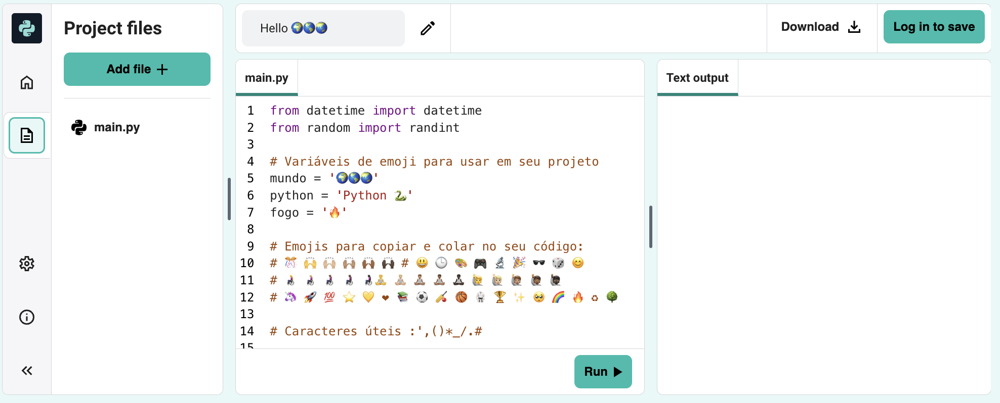
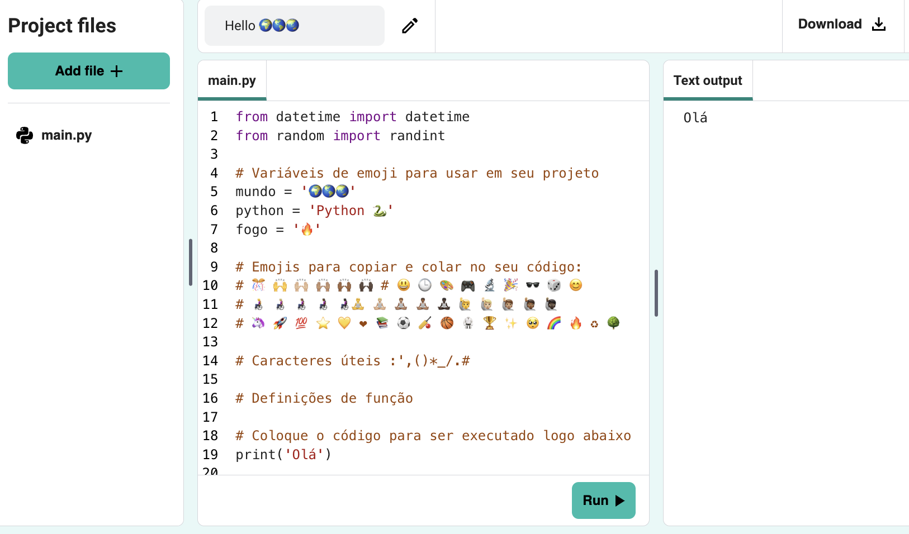
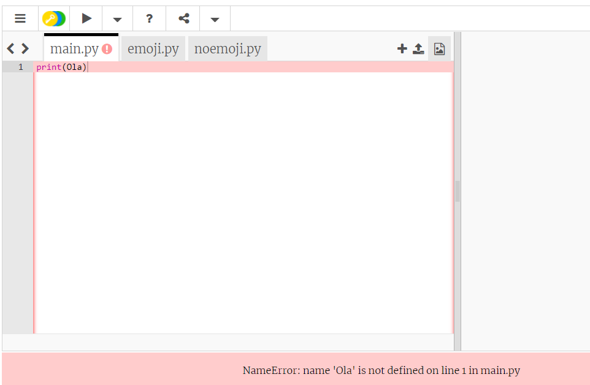
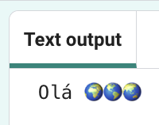
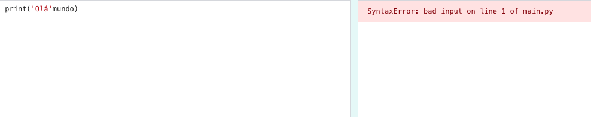

## Diga olá

<div style="display: flex; flex-wrap: wrap">
<div style="flex-basis: 200px; flex-grow: 1; margin-right: 15px;">
Tradicionalmente, ao aprender uma nova linguagem de programação, escrevemos primeiro um programa que exiba "Olá mundo!".
</div>
<div>

{:width="200px"}

</div>
</div>

--- task ---

Abra o [projeto inicial Olá 🌍🌎🌏](https://editor.raspberrypi.org/pt-BR/projects/hello-world-starter){:target="_blank"}. O Trinket será aberto em outra aba do navegador.



Se você tiver uma conta Raspberry Pi, pode clicar no botão **Salvar** para salvar uma cópia em seus **Projetos**.

--- /task ---

--- collapse ---

---
title: Trabalhando em um Raspberry Pi?
---

Se você estiver trabalhando em um Raspberry Pi usando o Chromium, talvez não veja os emojis. Você precisa instalar uma fonte que os suporte.

Abra um terminal e digite:

```bash
sudo apt install fonts-noto-color-emoji
```

Reinicie o Chromium e você verá os emojis coloridos.

--- /collapse ---

### Imprimir olá

<p style="border-left: solid; border-width:10px; border-color: #0faeb0; background-color: aliceblue; padding: 10px;">
As linhas que começam com `#` são <span style="color: #0faeb0">**comentários**</span>. Eles explicam o que o código fará. Os comentários são ignorados pelo Python.
</p>

As linhas `import` no início do código informam ao Python que você usará um código que não escreveu.

Em Python, `print()` gera texto (palavras ou números) na tela.

--- task ---

Encontre a linha `# Coloque o código para ser executado abaixo`.

Clique abaixo dessa linha. O `|` piscando é o cursor e mostra onde você irá digitar.

--- /task ---

--- task ---

Digite o código para `print()` um olá:

**Dica:** Ao digitar um parêntese de abertura `(` ou apóstrofo de abertura `'` o editor de código adicionará automaticamente um parêntese de fechamento `)` ou apóstrofo de fechamento`'`:

--- code ---
---
language: python
filename: main.py
line_numbers: true
line_number_start: 17
line_highlights: 18
---

# Coloque o código para ser executado logo abaixo
print('Olá')

--- /code ---

--- collapse ---
---
title: Digitando caracteres especiais em um teclado
---

Em um teclado, os parênteses esquerdo `(` e direito `)` estão nas teclas <kbd>9</kbd> e <kbd>0</kbd>. Para digitar um parêntese esquerdo, mantenha pressionada a tecla <kbd>Shift</kbd> (ao lado de <kbd>Z</kbd>) e toque em <kbd>9</kbd>. A aspa simples `'` está na mesma linha que a tecla <kbd>L</kbd>, logo antes da tecla <kbd>Enter</kbd>. A vírgula `,` está ao lado do <kbd>M</kbd>.

--- /collapse ---

--- /task ---

--- task ---

**Teste:** Clique no botão **Run** para executar seu código. No editor de código, a saída aparecerá à direita:



**Depuração:** Se você receber um erro, verifique seu código com muito cuidado. Neste exemplo, as aspas simples em torno de `Olá` estão faltando, então o Python não sabe que deve ser texto.



--- /task ---

## Imprimir 🌍🌎🌏

Em Python, uma **variável** é usada para armazenar texto ou números. As variáveis tornam mais fácil para os humanos lerem o código. Você pode usar a mesma variável em muitos lugares em seu código. Escolher um nome sensato para uma variável torna mais fácil para você lembrar para que ela serve.

Incluímos algumas variáveis que armazenam caracteres emoji.

--- task ---

Em seu editor de código, role até as linhas com os emojis armazenados em duas variáveis diferentes. Encontre a variável `mundo`, que armazena o texto '🌍🌍🌍'.

--- /task --- 

--- task ---

Você pode `print()` mais de um item por vez incluindo uma vírgula `,` entre os itens. `print()` adicionará um espaço entre cada item.

Altere seu código para também `print()` o conteúdo da variável `world`:

--- code ---
---
language: python
filename: main.py
line_numbers: true
line_number_start: 17
line_highlights: 18
---

# Coloque o código para ser executado logo abaixo
print('Olá', mundo)

--- /code ---

**Dica:** `'Olá'` é uma string de texto porque tem aspas simples, enquanto `world` é uma variável, então o valor armazenado nela será impresso.

--- /task ---

--- task ---

**Teste:** Execute seu código para ver o resultado:



**Dica:** Emojis podem parecer diferentes em computadores diferentes, então eles podem não ter a mesma aparência em um tablet e um computador desktop.

**Depuração:** Certifique-se de ter adicionado uma vírgula entre os itens em `print()` e de ter escrito `mundo` corretamente.

Neste exemplo está faltando a vírgula `,`. É pequeno, mas muito importante!



--- /task ---

--- task ---

Adicione outra linha `print()` para imprimir mais texto e emoji:

--- code ---
---
language: python
filename: main.py
line_numbers: true
line_number_start: 18
line_highlights: 19
---

print('Olá', mundo)    
print('Bem-vindo a', python)

--- /code ---

**Dica:** O código que você precisa digitar é destacado em uma cor mais clara. O código que não está destacado ajuda a localizar onde você precisa adicionar o novo código.

--- /task ---

--- task ---

**Teste:** Clique **Run**.


**Dica:** É uma boa ideia executar seu código após cada alteração para que você possa corrigir os problemas rapidamente.

**Depuração:** Verifique cuidadosamente se há parentêses, aspas, vírgulas e ortografia correta. Python precisa que você seja realmente preciso.

--- /task ---

Se você possui uma conta Raspberry Pi, em seu editor de código, você pode clicar no botão **Salvar** para salvar uma cópia do seu projeto em seus Projetos.

--- save ---
