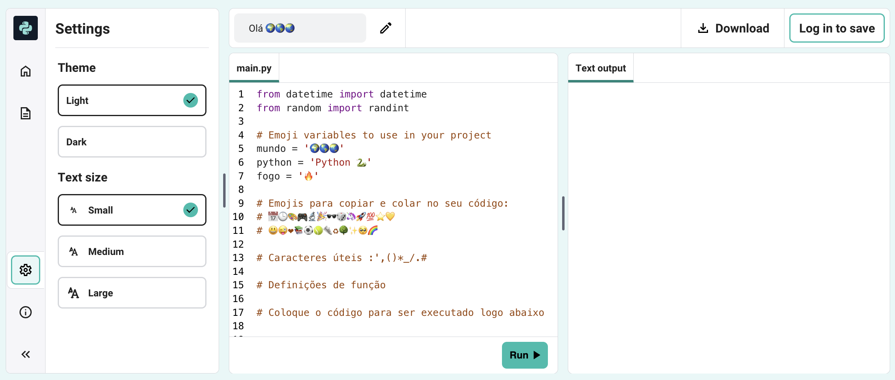

## Operações matemáticas e datas

Python é ótimo para trabalhar com números e datas.

{:width="300px"} 

Em Python você pode usar operadores matemáticos para fazer contas:

| + | adicionar |   
| - | subtrair |   
| * | multiplicar |   
| / | dividir |   
| ** |exponenciar |

### Criar um cálculo

--- task ---

Adicione outras duas linhas `print()` ao seu código, incluindo uma operação para o Python calcular:

**Dica:** Para obter um símbolo `*` , pressione <kbd>Shift</kbd> e <kbd>8</kbd> ao mesmo tempo.

--- code ---
---
language: python filename: main.py line_numbers: true line_number_start: 18
line_highlights: 20-21
---

print('Hello', world)   
print('Welcome to', python)   
print(python, 'é muito bom em matemática!')   
print(230 * 5782 ** 2 / 23781) # Imprime o resultado da soma

--- /code ---

**Dica:** Você não precisa digitar os comentários, eles estão lá apenas para ajudá-lo a entender o código. Basta digitar o código antes do `#`.

--- /task ---

--- task ---

**Teste:** Execute seu código. O Python calculou a operação corretamente? Só brincando! O Python faz a matemática difícil para você, então você não precisa resolvê-la.

**Depurar:**

--- collapse ---
---
título: Eu tenho um erro de sintaxe
---

Certifique-se de ter adicionado uma vírgula `,` entre os itens em `print()` e de ter escrito `python` corretamente.

--- /collapse ---

--- /task ---

A cientista da computação japonesa **Emma Haruka Iwao** usou um computador para calcular o valor de Pi (*π*) para 31 trilhões de dígitos. Essa resposta é tão longa que levaria mais de 300.000 anos para dizê-la! 

--- task ---

Tente mudar a soma que o Python faz para uma complicada!

Você também pode usar parênteses se quiser controlar a ordem em que o Python calcula a operação: `print( (2 + 4) * (5 + 3) )`.

--- /task ---

--- task ---

**Teste:** Execute seu código e faça o Python calcular sua soma.

**Depurar:** Certifique-se de que sua soma tenha um colchete esquerdo e direito em torno dela `( 2 * 45 )`. Se você usar parênteses extras para controlar a ordem, faça com que você tenha um parêntese direito para corresponder a cada parêntese esquerdo.

--- /task ---

--- task ---

No editor de código, você pode achar o texto muito grande ou muito pequeno para ler. Você pode alterar facilmente essas configurações de acordo com sua preferência.

**Dica:** Clique no menu **hambúrger** (o ícone com três linhas) no canto superior esquerdo do seu editor Trinket. Em seguida, clique em qualquer um dos botões **Text Size** para alterar o tamanho do texto.

Você também pode alternar entre os modos de cores, clique nos botões **Claro & Escuro** para ver as alterações.

--- /task ---

A linha `from datetime import *` na parte superior da guia **main.py** inclui uma biblioteca com funções úteis para obter a data e hora atuais.

Uma das grandes coisas sobre Python são todas as **bibliotecas** de código que estão disponíveis para uso. Uma biblioteca Python permite que você use facilmente o código que outras pessoas escreveram. Existem bibliotecas para desenhar tabelas e gráficos, fazer arte, fazer cálculos e muito mais.

--- task ---

Adicione outra linha ao seu código `print` para imprimir a data e hora atuais.

Obtenha a data e hora atuais usando a função `now()` da biblioteca `datetime`:

--- code ---
---
language: python filename: main.py line_numbers: true line_number_start: 20
line_highlights: 22
---

print(python, 'é muito bom em matemática!')    
print(230 * 5782 ** 2 / 23781) # Imprime o resultado da soma     
print('A data e hora são', datetime.now() ) # Imprime a data e hora atual

--- /code ---

**Dica:** Você não precisa digitar os comentários, eles estão lá apenas para ajudá-lo a entender o código. Basta digitar a parte antes do `#`.

--- /task ---

--- task ---

**Teste:** Execute seu código algumas vezes para ver a atualização de data e hora.

**Depuração:** Verifique se você tem um ponto final `.` entre `datetime` e `now`. Verifique cuidadosamente toda a pontuação.

--- /task ---

--- save ---
