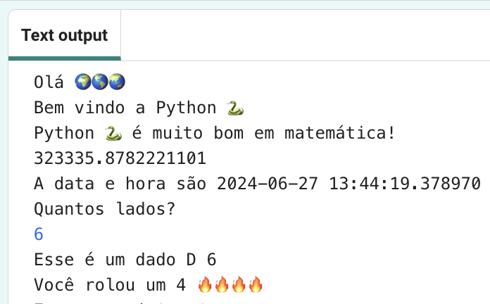
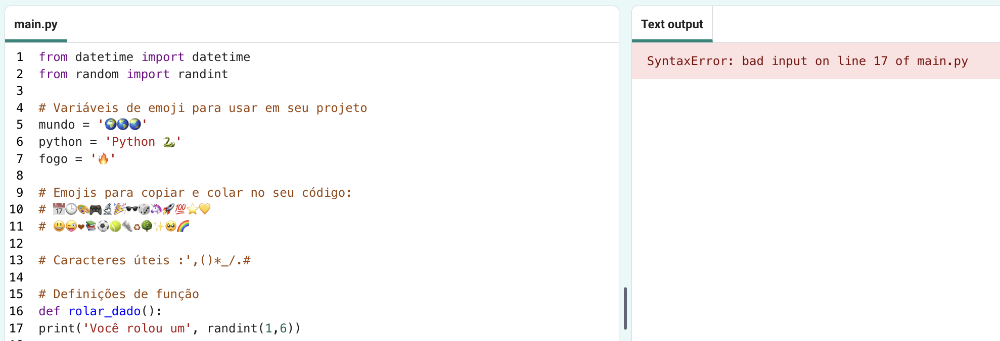

## Role um dado 🎲

Crie uma função para rolar um dado usando números aleatórios. 
  
Em Python:
  - **funções**, definidas com `def`, são como 'meus blocos' no Scratch,
  - `randint` é como 'random' no Scratch e
  - `input` é como 'ask' no Scratch.

{:width="300px"} 

Em Python você **chama** uma **função()** para executar uma ação. Você já usou a função `print()` para produzir texto.

Você pode **definir** uma nova **função** para agrupar o código para que você possa nomeá-lo e reutilizá-lo.

### Defina sua função

--- task ---

As funções precisam ser definidas antes que você possa chamá-las. Procure o comentário no arquivo **main.py** que diz `# Definições de função`.

Defina uma nova função chamada `rolar_dado()` que usa a função `randint()`, da biblioteca `random` para gerar um 'inteiro' aleatório (número inteiro) de 1 a 6 e enviá-lo para a tela.

--- code ---
---
language: python filename: main.py line_numbers: true line_number_start: 15
line_highlights: 16-17
---

# Definições de função
def rolar_dado(): # Não se esqueça dos dois pontos no final desta linha   
print('Você rolou um', randint(1, 6)) # randint(1, 6) é usado para dar um número entre 1 e 6.

--- /code ---

A linha abaixo de `def rolar_dado():` é **indentado**. Para fazer isso, use o caractere <kbd>Tab</kbd> no teclado (geralmente acima do <kbd>CAPSLOCK</kbd> no teclado). O código de recuo informa ao Python que as linhas recuadas fazem parte da função.

**Dica:** O sublinhado `_` é usado entre palavras em nomes de variáveis e funções em Python para facilitar a leitura. Você não pode usar um espaço.

--- collapse ---
---
title: Digitando caracteres especiais em um teclado do Reino Unido ou dos Estados Unidos
---

Em um teclado do Reino Unido ou dos EUA, os dois pontos `:` estão na mesma tecla que o ponto e vírgula, ao lado da tecla <kbd>L</kbd>: segure <kbd>Shift</kbd> e toque <kbd>;</kbd> para digitar um `:`. O sublinhado `_` está na mesma tecla que o `-`, próximo ao <kbd>0</kbd>, segure <kbd>Shift</kbd> e toque <kbd>-</kbd> para digitar um `_`.

--- /collapse ---

--- /task ---

--- task ---

**Teste:** Se você 'Executar' seu código agora, ele não rolará um dado. Isso porque você definiu a função `rolar_dado()`, mas ainda não a chamou.

**Depurar:**

--- collapse ---
---
title: Eu tenho um erro de sintaxe
---

- Certifique-se de ter um sublinhado `_` entre o lançamento e o dado para criar o nome da função.

- Certifique-se de ter dois pontos `:` no final da linha.

- Verifique se a linha abaixo de `def rolar_dado()` está recuada. É muito comum errar isso em Python, então certifique-se de verificar.

--- /collapse ---

--- /task ---

### Chame sua função

--- task ---

Para usar uma função, você precisa **chamar** lá no código. Vá para o final do seu código e adicione uma nova linha para chamar a função `rolar_dado()`:

--- code ---
---
language: python filename: main.py line_numbers: true line_number_start: 25
line_highlights: 27
---

print('A data e hora são', datetime.now())

rolar_dado() #Chama a função rolar dado

--- /code ---

--- /task ---

--- task ---

**Teste:** Execute seu projeto várias vezes para ver o dado aleatório rolar a cada vez.

--- /task ---

Os usos de números aleatórios incluem criptografia, ciência de dados e adição de variedade em jogos e arte de computador. Os computadores geram **números aleatórios** usando um algoritmo. Para números que são realmente aleatórios, você precisa de uma entrada imprevisível do mundo real.

### Use 🔥🔥🔥 para o número rolado

--- task ---

Sua função pode usar a variável emoji 🔥. O código `print(fire * 3)` gera três emojis de fogo '🔥🔥🔥'. Você precisa gerar o número correto de emojis para corresponder ao número rolado.

Altere seu código para salvar o valor retornado por `randint()` em uma variável chamada `rolar`. Use essa variável para imprimir o número rolado com o número correspondente de emojis 🔥.

--- code ---
---
language: python filename: main.py line_numbers: true line_number_start: 15
line_highlights: 17-18
---

# Definições de função
def rolar_dado(): rolar = randint(1, 6) # Gere um número aleatório entre 1 e 6 e armazene-o na variável 'rolar' print('Você rolou um', rolar, fire * rolar) # Repita o disparar emoji para corresponder ao rolo de dados aleatório

--- /code ---

**Dica** Você pode usar `estrelas` ou `coração` em vez de `fogo` se preferir, criando suas próprias variáveis de emoji.

--- /task ---

--- task ---

**Teste:** Teste seu projeto algumas vezes. Certifique-se de entender como o código funciona.

--- /task ---

### Escolha o número de lados do dado

Atualize seu dado para que o usuário possa escolher o número máximo.

Muitos jogos usam dados multifacetados. No mundo físico, os dados são feitos de formas geométricas regulares. Dados comuns incluem D6, D12 e D20. Em um computador, você pode gerar um número aleatório para fazer um dado com qualquer número de lados.

--- task ---

A função `input()` faz uma pergunta ao usuário e então retorna sua resposta.

**Adicione** código para pedir ao usuário o maior número em seus dados e, em seguida, salve o resultado em uma variável chamada `maximo` e `imprima` o número escolhido na área de saída:

Altere seu código de variável `rolar` para usar `maximo` como o valor máximo para `randint` quando gerar um número aleatório.

Quando você recebe uma entrada do usuário, o Python a trata como texto. Mas, `randint` precisa de um 'inteiro' (um número inteiro positivo). A função `int` transforma a entrada do usuário em um inteiro.

--- code ---
---
language: python filename: main.py line_numbers: true line_number_start: 15
line_highlights: 18-20
---

# Definições de função

def rolar_dado():   
maximo = input('Quantos lados?:') # Espera pela entrada do usuário    
print('Isso é um D', maximo) # Use o número que o usuário digitou    
rolar= randint(1, int(maximo)) # Use max para determinar o número de lados que o dado tem print('Você rolou um', rolar, fire * rolar)

--- /code ---

Para imprimir um apóstrofo `'`, coloque uma barra invertida `\` antes dele para que o Python saiba que é parte do texto.

--- /task ---

--- task ---

**Teste:** Execute seu código. Quando o programa atingir a linha `entrada`, ele aguardará que você insira uma resposta antes de continuar. Digite sua resposta e pressione <kbd>Enter</kbd>, isso permitirá que o programa colete sua resposta. Tente novamente com uma `entrada` de número diferente.

--- /task ---

--- save ---
