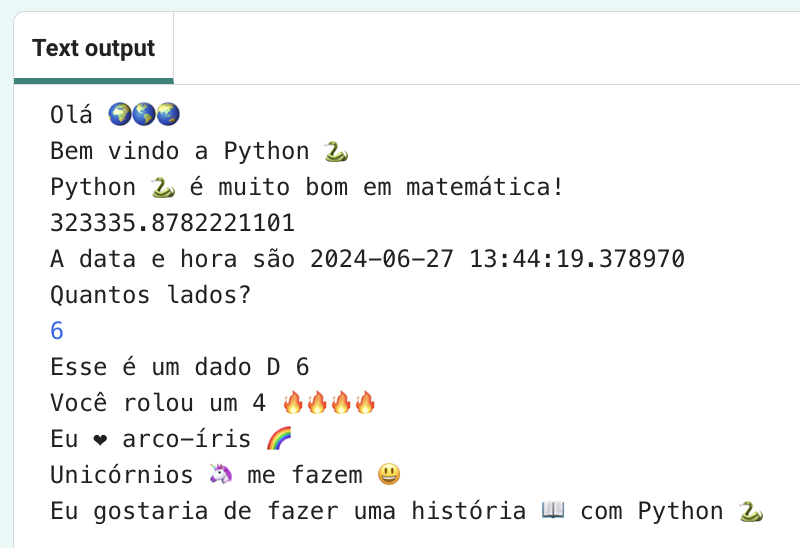

## Iniciador de frase

Emita mais frases do seu projeto.

{:width="300px"} 

--- task ---

Adicione mais linhas ao seu código com `print`. Aqui estão alguns iniciadores de frases que você pode usar:

--- code ---
---
language: python
filename: main.py
line_numbers: true
line_number_start: 29
line_highlights: 30-32
---

rolar_dado() # Chama a função de rolagem de dados
print('Eu ❤️ ...')   
print('... me faz 😃')   
print('Eu gostaria de fazer com..., python)

--- /code ---

**Dica:** Cada uso de `print()` adiciona uma linha intermediária.

**Dica:** Se você precisa imprimir um apóstrofo `'`, então você precisa colocar uma barra invertida `\` antes dele para que o Python saiba que é parte do texto.

**Dica:** Adicione um `#` no início de uma linha para transformá-la em um comentário.

--- /task ---

O emoji de coração amarelo 💛 é frequentemente usado para mostrar amizade e felicidade.

--- task ---

Que mensagem você enviaria para um amigo para animá-lo? Qual emoji você escolheria?

Role até a seção **emoji** no editor de código para ver os emojis e as variáveis de exemplo que você pode usar. Copie os que você escolher e salve-os em uma variável ou adicione-os diretamente ao seu código.

Você pode adicionar mais emojis à seção **emoji**. Use essa [lista de emoji](https://unicode.org/emoji/charts/full-emoji-list.html){:target="_blank"} para encontrar o que você deseja.

🎊 🙌 🙌🏼 🙌🏽 🙌🏾 🙌🏿 😃 🕒 🎨 🎮 🔬 🎉 🕶️ 🎲 😊
🦄 🚀 💯 ⭐ 💛 ❤️ 📚 ⚽ 🏏 🏀 🥋 🏆 ✨ 🥺 🌈 🔥 ♻️ 🌳
👩‍🦽👩🏼‍🦽👩🏽‍🦽👩🏾‍🦽👩🏿‍🦽🧘 🧘🏼 🧘🏽 🧘🏾 🧘🏿 🙋 🙋🏼 🙋🏽 🙋🏾 🙋🏿

[[[choose-an-emoji]]]

--- /task ---

--- save ---
