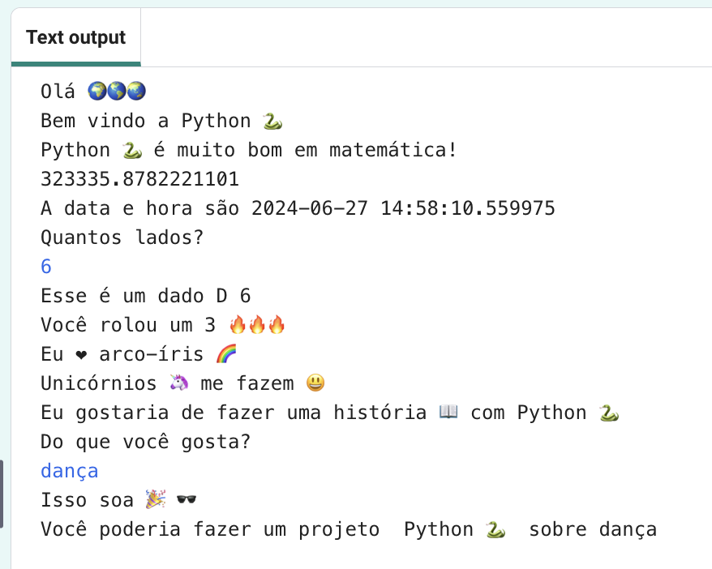

## Melhore o seu projeto

Adicione mais ao seu projeto. Há mais emoji para escolher.
  

{:width="300px"} 

Você pode:
+ Use `print()` com texto e emojis diferentes
+ Use `input` para obter valores do usuário e armazená-los como variáveis, então faça operações com as variáveis
+ Escreva mais funções para organizar seu código
+ Use `#` para adicionar comentários ao seu código

Role até a seção **emoji** no editor de código para ver os emojis e as variáveis de exemplo que você pode usar. Copie os que você escolher e salve-os em uma variável ou adicione-os diretamente ao seu código.

**Dica:** Para adicionar emojis, encontre o comentário # Emojis para copiar e colar em seu código. Copie os emojis que deseja usar e cole-os no seu código.

🎊 🙌 🙌🏼 🙌🏽 🙌🏾 🙌🏿 # 😃 🕒🎨🎮🔬🎉🕶️🎲 😊 🦄🚀💯⭐💛❤️📚⚽🏏🏀🥋🏆✨🥺🌈🔥♻️🌳 👩‍🦽👩🏼‍🦽👩🏽‍🦽👩🏾‍🦽👩🏿‍🦽🧘 🧘🏼 🧘🏽 🧘🏾 🧘🏿 🙋🙋🏼🙋🏽🙋🏾🙋🏿

[[[choose-an-emoji]]]

Aqui está uma função de exemplo que pergunta sobre hobbies:

--- code ---
---
language: python
filename: main.py
---

# Coloque o código para ser executado logo abaixo
def hobbies():   
hobby = input('Do que você gosta?')   
print('Parece', divertido) # Você precisará criar uma variável de emoji chamada 'diversão' print('Você poderia fazer a', python, 'projeto sobre', hobby)

--- /code ---

**Dica:** Não esqueça que você precisará chamar sua função e defini-la.

Você pode usar `input` para fazer seu projeto esperar que o usuário toque em <kbd>Enter</kbd> em qualquer ponto deste projeto.

--- code ---
---
language: python
filename: main.py
---

rolar_dado()

input() # espera o usuário tocar em Enter

hobbies() # Chama a função hobbies

--- /code ---

--- collapse ---
---
título: Projeto Concluído
---

You can view the [completed project here](https://editor.raspberrypi.org/en/projects/hello-world-solution){:target="_blank"}.

--- /collapse ---

--- save ---
