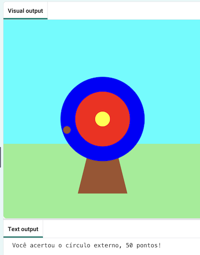

## E agora?

Se você está seguindo o caminho [Introdução ao Python](https://projects.raspberrypi.org/en/raspberrypi/python-intro), você pode avançar para o projeto [Tiro ao alvo](https://projects.raspberrypi.org/en/projects/target-practice). Neste projeto, você desenhará um alvo e depois fará um jogo de tiro com arco que atira flechas para marcar pontos.

--- print-only ---

{:width="640px"}

--- /print-only ---

--- no-print ---

Click the **Run** button to view an example of this project.

<iframe src="https://editor.raspberrypi.org/en/embed/viewer/target-practice-solution" width="600" height="600" frameborder="0" marginwidth="0" marginheight="0" allowfullscreen>
</iframe>

--- /no-print ---

If you want to have more fun exploring Python, then you could try out any of [these projects](https://projects.raspberrypi.org/en/projects?software%5B%5D=python).
