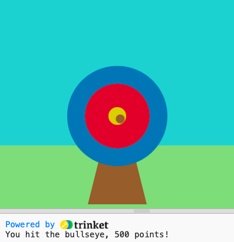

## E agora?

Se você está seguindo o caminho [Introdução ao Python](https://projects.raspberrypi.org/en/raspberrypi/python-intro), você pode avançar para o projeto [Tiro ao alvo](https://projects.raspberrypi.org/en/projects/target-practice). Neste projeto, você desenhará um alvo e depois fará um jogo de tiro com arco que atira flechas para marcar pontos.

--- print-only ---

--- /print-only ---

--- no-print ---

<iframe src="https://trinket.io/embed/python/f686c82d8a?outputOnly=true&start=result" width="600" height="500" frameborder="0" marginwidth="0" marginheight="0" allowfullscreen>
</iframe>

--- /no-print ---

Se você quiser se divertir mais explorando Python, então você pode tentar qualquer um [destes projetos](xhttps://projects.raspberrypi.org/en/projects?software%5B%5D=python).
