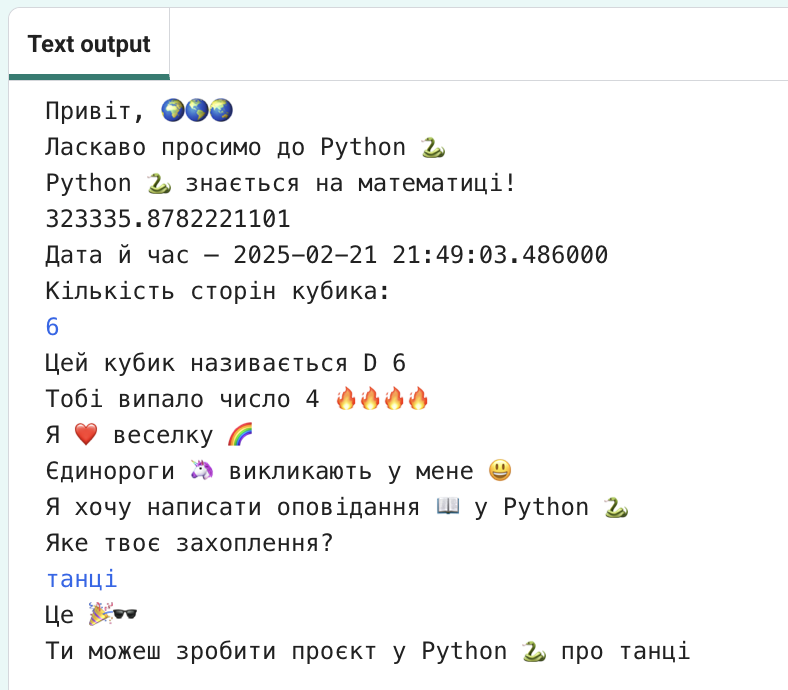

## Ти зробиш

Дізнаєшся, на що здатна мова програмування Python, написавши інтерактивний проєкт, який використовує емодзі.

**Емодзі**  це маленькі кольорові зображення, які додають додатковий сенс повідомленням. Емодзі в перекладі з японської означає "слово-картинка".

Зможеш:
+ Вивести текст за допомогою `print()`, включаючи емодзі, та отримати від користувача `input()` (вхідні дані)
+ Зберігати текст і числа у **змінних**
+ Використовувати **функції**, щоб упорядкувати свій код

--- no-print ---

### Грати ▶️

--- task ---

  
Прочитай вихідні дані та натисни <kbd>Enter</kbd>, щоб продовжити. 
Введи свої відповіді на запитання. Помічаєш, як використовуються твої відповіді?

  <iframe src="https://trinket.io/embed/python/a54e164ac2?outputOnly=true&start=result" width="600" height="500" frameborder="0" marginwidth="0" marginheight="0" allowfullscreen>
  </iframe>
  

--- /task ---

--- /no-print ---

--- print-only ---

--- /print-only ---

