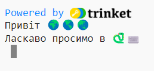
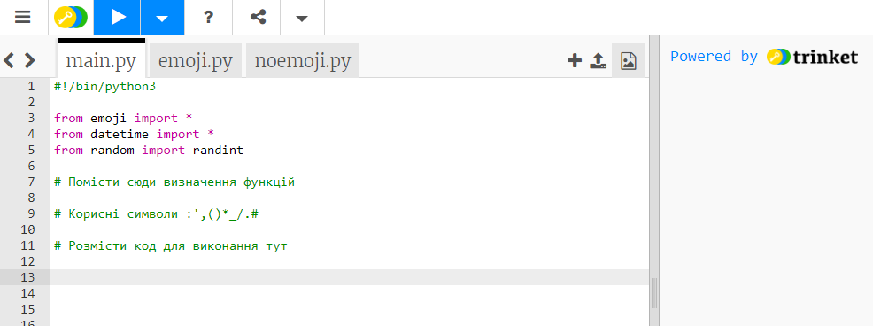
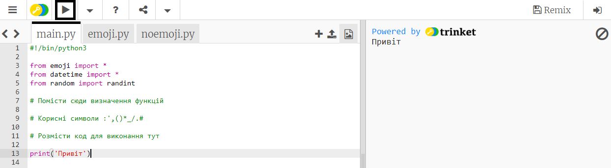
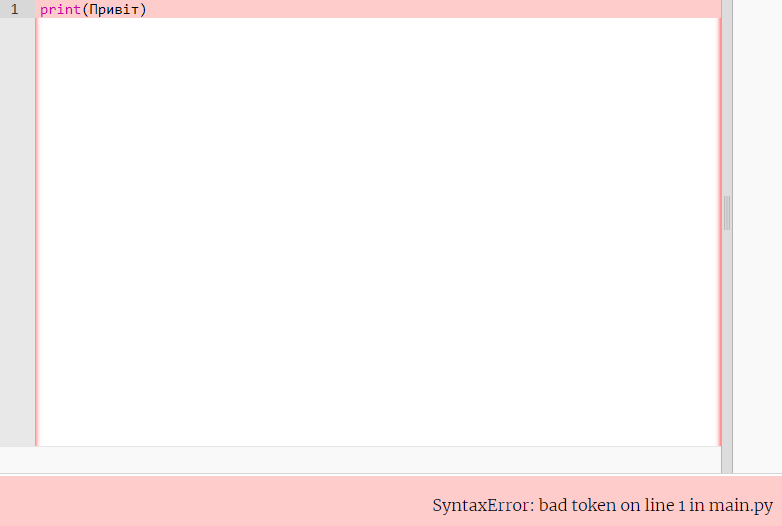
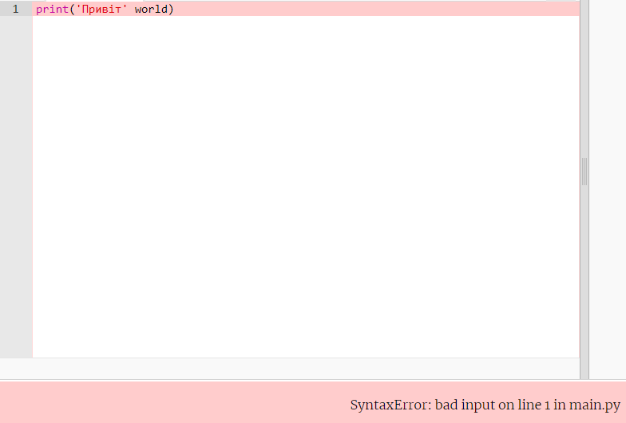

## Скажи "привіт"

Традиція при вивченні нової мови програмування - написати програму, яка виведе "Привіт, світ!".

{:width="200px"}

--- task ---

Відкрий [Стартовий проєкт Привіт 🌍🌎🌏](https://trinket.io/python/7d4ce378d7){:target="_blank"}. Trinket відкриється в окремій вкладці браузера.

--- /task ---

Рядок `#!/bin/python3` вказує Trinket, що використовується Python 3 (остання версія). Рядки `import` передають Python, що буде використано код, який був написаний не тобою.

У Python, код `print()` виводить текст (слова або числа) на екран.

Рядки, які починаються з `#` - це коментарі. Вони пояснюють код людині та ігноруються Python.

--- task ---

Знайди рядок `# Нижче розмісти код для виконання`.

Клацни нижче цього рядка. Блимаючий `|` є курсором і показує, де ти будеш вводити текст.

Введи код, щоб зробити `print()` привіт:

--- code ---
---
language: python 
filename: main.py 
line_numbers: true 
line_number_start: 11
line_highlights: 12
---

# Розмісти код для виконання тут
print('Привіт')

--- /code ---

--- collapse ---
---
title: Набір спеціальних символів на англійській розкладці клавіатури
---

На англійській розкладці клавіатури, ліві `(` та праві `)` круглі дужки знаходяться на клавішах<kbd>9</kbd> та <kbd>0</kbd>. Щоб надрукувати ліву круглу дужку, натисни та утримуй клавішу <kbd>Shift</kbd> (поруч з <kbd>Z</kbd>) і натисни на <kbd>9</kbd>. Одинарна лапка `'` знаходиться в одному рядку з клавішею <kbd>L</kbd>, перед клавішею <kbd>Enter</kbd>. Кома `,` знаходиться поруч з клавішею <kbd>M</kbd>.

--- /collapse ---

--- /task ---

--- task ---

**Тест:** Натисни на кнопку **Запуск**, щоб виконати твій код. У Trinket вихідні дані будуть відображатися праворуч:

**Налагодження:** Якщо виникла помилка, необхідно дуже уважно перевірити свій код. У цьому прикладі одинарні лапки навколо `Привіт` відсутні, тому Python не знає, що це має бути текстом.

--- /task ---

У Python **змінна** використовується для зберігання тексту або чисел. Змінні полегшують читання коду для людей. Ти можеш використовувати одну і ту ж змінну в багатьох місцях твого коду.

Ми вже додали деякі змінні, які зберігають символи емодзі.

--- task ---

У власному Trinket, натисни на вкладку **emoji.py**. Знайди змінну `world`, в якій зберігається текст '🌍🌍🌍'.

--- /task --- 

--- task ---

Ти можеш зробити `print()` більше одного елемента водночас, використовуючи кому `,` між цими елементами. `print()` додасть пробіл між кожним елементом.

Натисни на вкладку **main.py**, щоб повернутися до твого коду `print()`.

Зміни свій код так, щоб зробити `print()` змісту змінної `world`:

--- code ---
---
language: python 
filename: main.py 
line_numbers: true 
line_number_start: 11
line_highlights: 12
---

# Розмісти код для виконання тут
print('Привіт', world)

--- /code ---

**Порада:** `'Привіт'` - це текстовий рядок, тому що навколо нього розташовані одинарні лапки, в той час, як `world` - це змінна, тобто значення, що зберігається в ній, буде виведено на екран.

--- /task ---

--- task ---

**Тест:** Запусти свій код, щоб побачити результат:

Емодзі можуть виглядати по-різному на різних комп'ютерах, тому на твоєму комп'ютері вони можуть виглядати не зовсім однаково.

**Налагодження:** Переконайся, що кома додана між елементами в рядках `print()` і що `world` написано правильно.

У цьому прикладі не вистачає коми `,`. Маленька, але дуже важлива!

--- collapse ---
---
title: Я не бачу емодзі
---

Більшість комп'ютерів підтримують використання кольорових емодзі. Однак, якщо ти не можеш використовувати емодзі, ти можеш використовувати "смайлики". Ми робили це до того, як емодзі були придумані!

Зміни рядок `from emoji import *` на:

--- code ---
---
language: python 
filename: main.py 
line_numbers: true 
line_number_start: 3
line_highlights: 3
---

from noemoji import *

--- /code ---

--- /collapse ---

--- /task ---

--- task ---

Додай ще один рядок до коду, щоб зробити `print()` додаткового тексту та емодзі:

--- code ---
---
language: python 
filename: main.py 
line_numbers: true 
line_number_start: 12
line_highlights: 13
---

print('Привіт', world)    
print('Ласкаво просимо в', python)

--- /code ---

**Порада:** Код, який потрібно ввести, виділено світлішим кольором. Код, який не підсвічується, допомагає знайти місце, де необхідно додати новий код.

--- /task ---

--- task ---

**Тест:** Клацни на кнопку **запуску**.

**Порада:** Рекомендується запускати код після кожної зміни, щоб можна було швидко усунути помилки.

**Налагодження:** Уважно перевіряй наявність дужок, лапок, ком та правопис. Python вимагає від тебе особливої уважності.

--- /task ---

Якщо у тебе є обліковий запис в Trinket, ти можеш натиснути на кнопку **Remix**, щоб зберегти копію у свою бібліотеку `My Trinkets`.

Якщо у тебе немає облікового запису Trinket, ти все одно можеш повернутися до свого проєкту в майбутньому на тому ж комп'ютері, скориставшись посиланням на стартовий проєкт.

--- save ---
