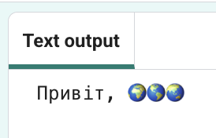
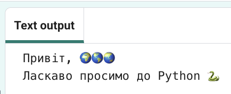

## Виведи на екран привітання

У мові програмування Python слово `print()`{:.language-python} виводить на екран рядки слів або чисел.

--- task ---

Відкрий [стартовий проєкт «Привіт, 🌍🌎🌏»](https://editor.raspberrypi.org/uk-UA/projects/hello-world-starter){:target="_blank"}. Редактор коду відкриється в окремій вкладці браузера.

--- /task ---

--- task ---

Знайди рядок `# Нижче розмісти код, який потрібно виконати`{:.language-python}.

Клацни нижче цього рядка. Миготливий символ `|` — це курсор. Він показує, де ти будеш вводити текст.

--- /task ---

--- task ---

Введи такий код, щоб вивести на екран слово «Привіт»:

--- code ---
---
language: python
line_numbers: true
line_number_start: 20
line_highlights: 21
---
# Нижче розмісти код, який потрібно виконати
print(f'Привіт')

--- /code ---

--- /task ---

--- task ---

**Протестуй:** натисни на кнопку **Run** («Запустити»), щоб виконати код.

Ти маєш побачити напис `Привіт` в області виведення.

--- /task ---

Використовуй **змінні**, щоб зберігати певні значення, як-от текст або числа. Ми вже додали декілька змінних, які зберігають емоджі.

--- task ---

Зміни свій код так, щоб він також виводив вміст змінної `world`{:.language-python} (англійською «світ») на екран за допомогою `print()`{:.language-python}. Щоб це зробити, додай назву змінної у фігурних дужках `{}`{:.language-python}.

--- code ---
---
language: python
line_numbers: true
line_number_start: 20
---
# Нижче розмісти код, який потрібно виконати
print('Привіт,' {world}')

--- /code --- 

Символ `f`{:.language-python} всередині `print`{:.language-python} дозволяє тобі легко виводити на екран змінні разом із рядками тексту.

--- /task ---

--- task ---

**Протестуй:** запусти свій код і подивись, що вийшло:

--- /task ---

--- task ---

**Додай** ще один рядок до коду, щоб вивести на екран додатковий текст і емоджі за допомогою `print()`{:.language-python}:

--- code ---
---
language: python
line_numbers: true
line_number_start: 20
line_highlights: 22
---
# Нижче розмісти код, який потрібно виконати
print(f'Привіт, {world}')
print(f'Ласкаво просимо до {python}')

--- /code ---

--- /task ---

--- task ---

**Протестуй:** натисни кнопку **Run**.

**Порада:** запускай код після кожної зміни, щоб можна було швидко усунути помилки.

--- /task ---

